# CKME 136 Capstone Project

# Melbourne House Sales Price Predictive Analysis

#### For best display, please visit project github page <https://github.com/ludejia/CapstoneProject>

#### Analysis and code are in the R mark down file ‘Code.RMD’

#### Dejia Lu

#### Ryerson University 501005537

## Introduction

Since 2010, Melburne housing market was experiencing a housing bubble
and some expert said it might burst soon. However, there was a cooling
period in 2018. The contributor of the housing market data set was
considering buying an apartment. He was seeking data experts to help him
draw some insights on the data to assist his decision making.

In Capstone Project, my goal is to explore and understand the relation
between the final sold price and different variable factors, perform
Predictive Analytics using various machine learning algorithms, compare
the performances and differences among these models and find the best
model for property price prediction. The procedures I will be following
are exploratory analysis, date cleaning, feature engineering, model
building and model evaluation.

## Literature Review

After reviewing books, website, journals and video, I found some
methodologies and techniques are especially helpful in data
visualization and preparation, feature selection & modelling building,
and model performance evaluation.

EDA (exploratory data cleaning) is a very important step when conducting
initial analyse, De Jonge & Van Der Loo’s book (2013) detail various
data preprocessing techniques including missing value handling, data
conversion and data manipulation. They also give examples in R
environment. They suggested various way to impute missing value such as
hot-deck imputation and knn imputation. The book ‘Hands-on exploratory
data analysis with R’(Datar & Garg, 2019) not only demonstrates
practical data manipulation process using different R packages but also
dedicated a big portion in data visualizing utilizing ggplot2 package
which makes the data much more easily to be understood. For example, in
scatter plot and density plot, colors are used as a new dimension to
differentiate categories.

The dataset provides GPS location information for each house. It would
be especially helpful to visualize the houses on the map and to color
these points by different properties to understand the geographic impact
on the houses. The book ggmap: Spatial visualization with ggplot2(Kahle
& Wickham, 2013) showed the step by step approach to import map from
google map and plot those points in a meaningful way.

In terms of feature selection and modeling building, An introduction to
statistical learning: With applications in R (James et al. 2013) has a
comprehensive coverage on all the popular algorithms and their
mathematical explanations. For each algorithm, it has multiple lab
exercise in R environment dedicated to it so you can apply the theory to
real dataset. In the section of linear model selection, it provided
multiple ways to select the best features of the dataset. I learned
Ridge Regression, Lasso Regression, Random Forest and Support Vector
Machine and their application in this book. The elements of statistical
learning: Data mining, inference, and prediction (Hastie et al., 2009)
gives an in-depth math and statistical concepts on modelling and model
evaluations. Due to its missing of application in R environment, I used
this book as a supplement reading to the previous modelling book for the
concepts that I am not so clear about.

## Dataset, data manipulation, feature engineering and selection

The dataset I am using was posted on Kaggle and scraped by the
contributor Pino(2018) from an Australian property website
(Domain.com.au) for the period from 2016 to 2018. The data set contains
the propterty information of has 34857 observations. Each observation
has 21 attributes. Price is the attribute I am building model to
predict. Below provides the summary for the data and visualizaiton of
missing
values.

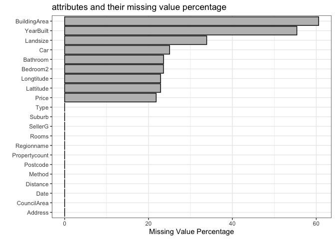<!-- -->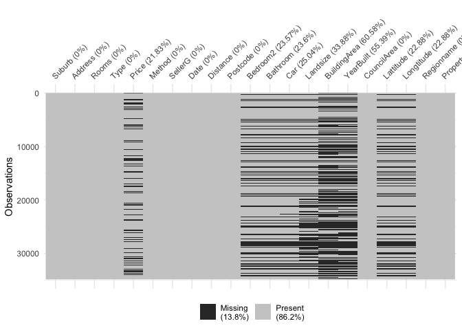<!-- -->

#### *Attributes explanation and selection*

#### Lattitude & Longtitude

“Lattitude” & “Longtitude” are the GPS location data. 23% of the data
are missing. Below we can visualize the location of the properties on
google map and see which area has the high density of the property.

<!-- -->

#### Price & PricePerSquareMeters

“Price” is the sold price in Australian dollar for the property. I
replace the unit of price to million Australian dollars. I created a
feature “PriceSQM” to represent price per square meter as it’s also the
common measure of property value and easier to understand its
interaction with the features. I remove the data points having missing
value in price and building area, and remove the outliers on PriceSQM
using boxplot. After the cleaning, total number of observations reduces
to 10395. Below shows the missing value after cleaning and price per
square meter distribution.

I removed the outliers by discarding the data with price per square
meter less than 2000 and over 15000 based on reasonable price range in
Melbourne.

<!-- -->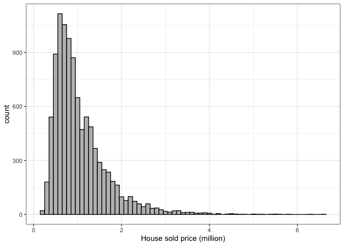<!-- -->

#### BuildingArea, Landsize, Building Area Ratio

“Landsize” is the size of the land the property occupies. “BuildingArea”
is the floor square meters of the house, town house or unit. For unit or
townhouse, landsize could be very big but the building area might be
small as the land are shared by many units or townhouses.

Data cleaning: For the house type, I remove the data having building
areas less than 40 square meters.

For landsize, there are missing values, zero landsize, unreasonable
large landsize and landsizes that are smaller than building area. I
impute these values by the median of different house types.

I replace landsize with Building Area Ratio ( Building Area / Landsize),
because for unit and townhouse, multiple properties share one land, and
Building Area Ratio would be relative small. Building Area ratio
reflects the interaction between landize and building type.

<!-- -->

#### Suburb, Postcode, Regionname, CouncilArea

“Suburb”, “Postcode”, “Regionname”, “CouncilArea” divide Melbourne into
different sections. Below we can find Suburb has the finest divisions
(351) whereas regionname only has 9 divisions.

I will only use CouncilArea and region name as the rest have too many
categories.

<!-- -->

This map shows the boundaries of Suburb, Postal Code, Council and
Region.


Below is the price per square meter distribution for different regions.
Quite obvious, southern metropolitan is more expensive. The red the
points on the map are these properties in Southern Metropolitan.

I use council area and Region name as geigraphycal variable and discard
the rest including GPS
info.

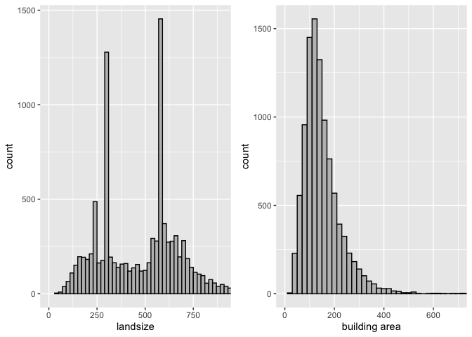<!-- -->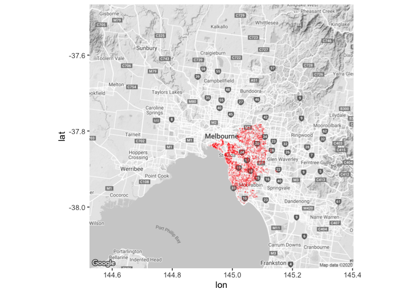<!-- -->

#### Propertycount

“Propertycount” is number of properties that exist in the suburb where
the property is located. We can see most properties are in a suburb
which has less than 50 properties in its suburb. I converted it from
categorial to numeric.

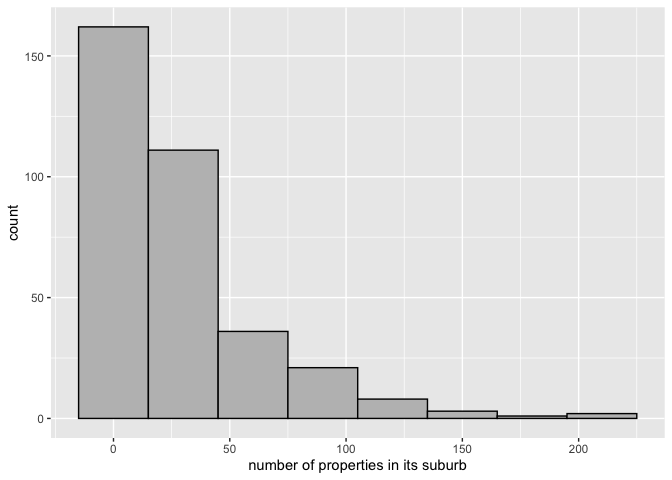<!-- -->

#### address

Each property has its own address. It would not be included in the model
as we already have Regionname, CouncilArea as geographical features.

#### Type

There are three types of houses.

“House” reprents house,cottage,villa, semi,terrace.

“Unit” reprents apartment, condo, duplex.

“Townhouse” repsents townhouse only.

Below we could see the total number of each type and sold price
distribution.

<!-- -->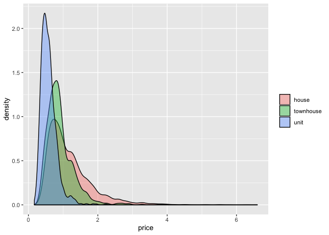<!-- -->

#### Rooms, bedroom2

“Rooms” and “bedroom2” are very similar, which is the number of bedrooms
in the property. “Rooms” has no missing value and “bedroom2” has 23%
percent missing value and is scraped by the contributor from different
sources. “bedroom2” would be discarded in the model.

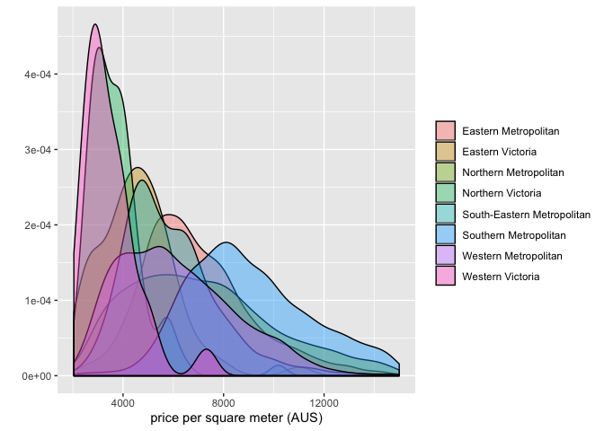<!-- -->

#### bathroom

“bathroom” is the number of bathroom. Below we can find “bathroom” and
“rooms” are correlated.

<!-- -->

``` 

    Pearson's product-moment correlation

data:  house$Rooms and house$Bathroom
t = 80.279, df = 10053, p-value < 2.2e-16
alternative hypothesis: true correlation is not equal to 0
95 percent confidence interval:
 0.6129583 0.6367832
sample estimates:
      cor 
0.6250163 
```

#### car

“car” is the number of parking spots each property has. The bar chart
shows the distribution. Car has 1.67% missing values which are imputed
using median.

<!-- -->

#### Distance

“Distance” is the distance in km from the property to the center
business district.

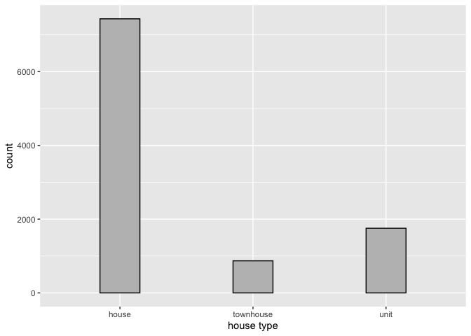<!-- -->

#### yearbuilt

The year the property is built. I group years to diffent categories to
visualize the data. The categories are “\<1900”, “1900~1949”,
“1950~1979”, “1980~1999”,‘2000~2010’. ‘yearbuilt’ has some missing
values. For yearbuilt, I will use numeric format.

I replace one data point built before 1880 with median value.

<!-- -->

#### date & AVGmonth\_price

“date” is the date the property was sold. The plot shows the average
price per squar meter for all the property sold per month. We could find
the the average month price fluctuate greatly which is a big factor
affacts the price. Instead of using the date, we would use average price
per square meter for all the property sold that specific month as a
variable which reflects seanonal impact of market fluctuation and
economical influency such as demand and supply.There are only 16 data
points for the first month so the average price would can not reflect
the true mean very well. So these data points are removed.

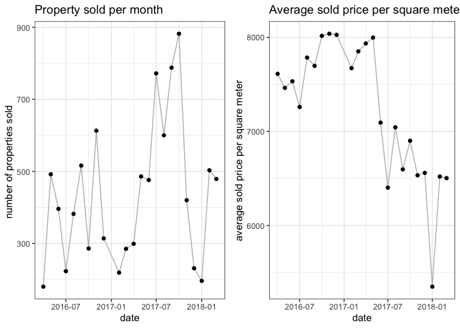<!-- -->

#### method

“method” reflects how the house was sold. Below are the meanings of
different method and the distribution chart.

PI - property passed in;

S - sold not disclosed;

SA - sold after auction;

SP - property sold prior;

VB - vendor bid

<!-- -->

#### SellerG

SellerG is Seller informaion and will not be included.

#### Final dataset to build the model with no missing values

    'data.frame':   10038 obs. of  15 variables:
     $ Rooms            : int  3 4 3 2 3 2 2 3 3 2 ...
     $ Type             : Factor w/ 3 levels "house","townhouse",..: 1 1 1 1 1 3 1 1 1 1 ...
     $ Price            : num  1.47 1.6 1.88 1.1 1.35 ...
     $ Method           : Factor w/ 5 levels "PI","S","SA",..: 4 5 2 2 5 2 2 2 2 2 ...
     $ Distance         : num  2.5 2.5 2.5 2.5 2.5 2.5 2.5 2.5 2.5 2.5 ...
     $ Bathroom         : int  2 1 2 1 2 2 1 2 1 1 ...
     $ Car              : int  0 2 0 2 2 1 2 1 1 1 ...
     $ Landsize         : int  571 571 245 220 214 301 238 113 138 150 ...
     $ BuildingArea     : num  150 142 210 75 190 94 97 110 105 73 ...
     $ YearBuilt        : num  1900 2014 1910 1900 2005 ...
     $ CouncilArea      : Factor w/ 33 levels "Banyule City Council",..: 32 32 32 32 32 32 32 32 32 32 ...
     $ Regionname       : Factor w/ 8 levels "Eastern Metropolitan",..: 3 3 3 3 3 3 3 3 3 3 ...
     $ Propertycount    : num  191 191 191 191 191 191 191 191 191 191 ...
     $ BuildingAreaRatio: num  0.263 0.249 0.857 0.341 0.888 ...
     $ AVGprice         : num  7851 7533 7462 8016 8038 ...
    NULL

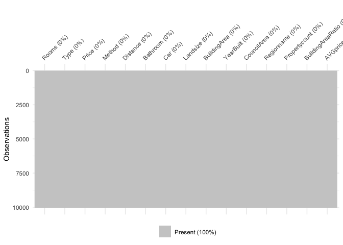<!-- -->

## Approach


#### Step 1: Exploratory Data Analysis

Explore and visualize each attribute and its relation to the prediction
variable; Perform data cleaning and feature engineering to find or
create the best the relevant features to feed into the model;

#### Step 2: Model Building & Tuning

Build models using various algorithms; Fine tuning parameters to achieve
best performance for each algorithm; Adjust features if needed;

#### Step 3: Model Evaluation

Perform cross-validation to compare performance across different models
and decide on the final model.

### linear Modelling

Below is the correlation graph of all the numeric variables and we can
find that number of rooms are hight correlated with number of bathroom.
Price per square meter is highly correlated with YearBuilt and Distance
from CBD.

<!-- -->

### linear model

Below we implemented forward, backward, forward stepwise and backward
stepwise for feature selection, which all select the same feature
including Rooms, Type, Method, Distance, Bathroom, Car, YearBuilt,
CouncilArea, Regionname, BuildingAreaRatio, AVGprice. Propertycount is
not selected for all the methods.

``` r
null=lm(Price~1,data=house)
full=lm(Price~.,data=house)
stepAIC(null, scope=list(lower=null, upper=full), direction= "forward", trace=TRUE)
stepAIC(full, direction= "backward", trace=TRUE)
stepAIC(null, scope=list(lower=null, upper=full), direction= "both", trace=TRUE)
stepAIC(full, direction= "both", trace=TRUE)
```

Below are the summary of the model.Adjusted R-squared is 0.7548 for this
model. I plot the the prediction, residual of this model.

``` 

Call:
lm(formula = Price ~ Rooms + Type + Method + Distance + Bathroom + 
    Car + BuildingArea + YearBuilt + CouncilArea + Regionname + 
    BuildingAreaRatio + AVGprice, data = house)

Residuals:
    Min      1Q  Median      3Q     Max 
-2.1278 -0.1608 -0.0144  0.1350  3.4949 

Coefficients:
                                            Estimate Std. Error t value
(Intercept)                                6.040e+00  2.231e-01  27.078
Rooms                                      5.859e-02  5.439e-03  10.772
Typetownhouse                             -1.165e-01  1.360e-02  -8.564
Typeunit                                  -3.174e-01  1.130e-02 -28.083
MethodS                                    6.903e-02  9.768e-03   7.067
MethodSA                                   1.722e-02  3.925e-02   0.439
MethodSP                                   5.593e-02  1.212e-02   4.615
MethodVB                                   1.468e-02  1.338e-02   1.098
Distance                                  -3.252e-02  1.247e-03 -26.079
Bathroom                                   9.606e-02  6.363e-03  15.097
Car                                        2.210e-02  3.678e-03   6.008
BuildingArea                               3.563e-03  7.208e-05  49.428
YearBuilt                                 -2.726e-03  1.130e-04 -24.119
CouncilAreaBayside City Council            6.299e-01  3.044e-02  20.697
CouncilAreaBoroondara City Council         5.698e-01  2.803e-02  20.328
CouncilAreaBrimbank City Council          -1.672e-01  4.107e-02  -4.070
CouncilAreaCardinia Shire Council          5.679e-01  1.118e-01   5.079
CouncilAreaCasey City Council              2.732e-01  5.811e-02   4.701
CouncilAreaDarebin City Council            1.451e-01  2.491e-02   5.826
CouncilAreaFrankston City Council          5.104e-01  5.329e-02   9.576
CouncilAreaGlen Eira City Council          3.222e-01  2.896e-02  11.127
CouncilAreaGreater Dandenong City Council  1.996e-01  5.269e-02   3.788
CouncilAreaHobsons Bay City Council        6.309e-02  4.363e-02   1.446
CouncilAreaHume City Council              -1.927e-02  2.717e-02  -0.709
CouncilAreaKingston City Council           3.019e-01  3.826e-02   7.891
CouncilAreaKnox City Council               7.476e-03  3.386e-02   0.221
CouncilAreaMacedon Ranges Shire Council    3.576e-01  1.041e-01   3.437
CouncilAreaManningham City Council         8.685e-02  2.374e-02   3.658
CouncilAreaMaribyrnong City Council       -5.945e-02  4.318e-02  -1.377
CouncilAreaMaroondah City Council          1.103e-01  3.259e-02   3.385
CouncilAreaMelbourne City Council          2.206e-01  2.711e-02   8.137
CouncilAreaMelton City Council            -2.479e-01  5.262e-02  -4.710
CouncilAreaMitchell Shire Council          2.680e-01  1.417e-01   1.891
CouncilAreaMonash City Council             2.542e-01  2.663e-02   9.544
CouncilAreaMoonee Valley City Council      6.769e-02  4.245e-02   1.595
CouncilAreaMoorabool Shire Council        -2.946e-02  3.133e-01  -0.094
CouncilAreaMoreland City Council           1.051e-01  2.540e-02   4.140
CouncilAreaNillumbik Shire Council        -2.152e-01  7.567e-02  -2.843
CouncilAreaPort Phillip City Council       3.039e-01  3.204e-02   9.487
CouncilAreaStonnington City Council        5.668e-01  3.247e-02  17.456
CouncilAreaWhitehorse City Council         1.503e-01  2.983e-02   5.039
CouncilAreaWhittlesea City Council         5.661e-02  2.944e-02   1.923
CouncilAreaWyndham City Council           -2.103e-01  4.333e-02  -4.854
CouncilAreaYarra City Council              2.779e-01  3.006e-02   9.247
CouncilAreaYarra Ranges Shire Council      2.516e-01  8.848e-02   2.844
RegionnameEastern Victoria                -6.635e-02  6.649e-02  -0.998
RegionnameNorthern Metropolitan           -2.322e-01  2.427e-02  -9.568
RegionnameNorthern Victoria                2.154e-01  6.953e-02   3.098
RegionnameSouth-Eastern Metropolitan      -8.727e-02  3.545e-02  -2.462
RegionnameSouthern Metropolitan           -1.170e-01  2.520e-02  -4.644
RegionnameWestern Metropolitan            -1.285e-01  4.044e-02  -3.178
RegionnameWestern Victoria                 2.618e-01  7.212e-02   3.630
BuildingAreaRatio                         -1.601e-01  1.927e-02  -8.309
AVGprice                                  -1.924e-05  5.343e-06  -3.602
                                          Pr(>|t|)    
(Intercept)                                < 2e-16 ***
Rooms                                      < 2e-16 ***
Typetownhouse                              < 2e-16 ***
Typeunit                                   < 2e-16 ***
MethodS                                   1.69e-12 ***
MethodSA                                  0.660795    
MethodSP                                  3.98e-06 ***
MethodVB                                  0.272449    
Distance                                   < 2e-16 ***
Bathroom                                   < 2e-16 ***
Car                                       1.94e-09 ***
BuildingArea                               < 2e-16 ***
YearBuilt                                  < 2e-16 ***
CouncilAreaBayside City Council            < 2e-16 ***
CouncilAreaBoroondara City Council         < 2e-16 ***
CouncilAreaBrimbank City Council          4.74e-05 ***
CouncilAreaCardinia Shire Council         3.86e-07 ***
CouncilAreaCasey City Council             2.63e-06 ***
CouncilAreaDarebin City Council           5.86e-09 ***
CouncilAreaFrankston City Council          < 2e-16 ***
CouncilAreaGlen Eira City Council          < 2e-16 ***
CouncilAreaGreater Dandenong City Council 0.000153 ***
CouncilAreaHobsons Bay City Council       0.148242    
CouncilAreaHume City Council              0.478054    
CouncilAreaKingston City Council          3.32e-15 ***
CouncilAreaKnox City Council              0.825257    
CouncilAreaMacedon Ranges Shire Council   0.000591 ***
CouncilAreaManningham City Council        0.000255 ***
CouncilAreaMaribyrnong City Council       0.168597    
CouncilAreaMaroondah City Council         0.000715 ***
CouncilAreaMelbourne City Council         4.53e-16 ***
CouncilAreaMelton City Council            2.51e-06 ***
CouncilAreaMitchell Shire Council         0.058672 .  
CouncilAreaMonash City Council             < 2e-16 ***
CouncilAreaMoonee Valley City Council     0.110837    
CouncilAreaMoorabool Shire Council        0.925070    
CouncilAreaMoreland City Council          3.51e-05 ***
CouncilAreaNillumbik Shire Council        0.004473 ** 
CouncilAreaPort Phillip City Council       < 2e-16 ***
CouncilAreaStonnington City Council        < 2e-16 ***
CouncilAreaWhitehorse City Council        4.77e-07 ***
CouncilAreaWhittlesea City Council        0.054565 .  
CouncilAreaWyndham City Council           1.23e-06 ***
CouncilAreaYarra City Council              < 2e-16 ***
CouncilAreaYarra Ranges Shire Council     0.004469 ** 
RegionnameEastern Victoria                0.318362    
RegionnameNorthern Metropolitan            < 2e-16 ***
RegionnameNorthern Victoria               0.001952 ** 
RegionnameSouth-Eastern Metropolitan      0.013833 *  
RegionnameSouthern Metropolitan           3.47e-06 ***
RegionnameWestern Metropolitan            0.001489 ** 
RegionnameWestern Victoria                0.000285 ***
BuildingAreaRatio                          < 2e-16 ***
AVGprice                                  0.000318 ***
---
Signif. codes:  0 '***' 0.001 '**' 0.01 '*' 0.05 '.' 0.1 ' ' 1

Residual standard error: 0.306 on 9984 degrees of freedom
Multiple R-squared:  0.7561,    Adjusted R-squared:  0.7548 
F-statistic: 583.9 on 53 and 9984 DF,  p-value: < 2.2e-16
```

<!-- -->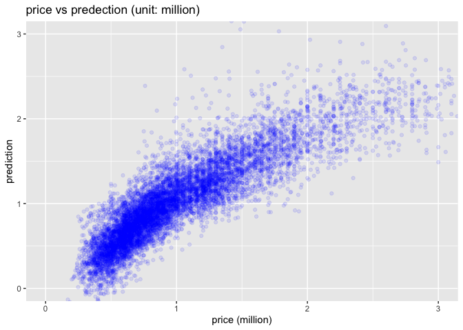<!-- -->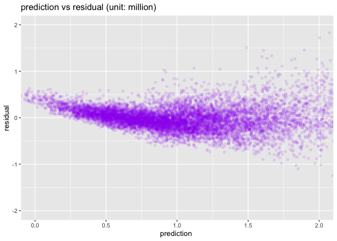<!-- -->

From the above graph, we find that the residual shows high level of
residual heteroscedasticity. So I decide to transform the price to log
price to minimize the heteroscedasticity. After the transformation, we
could find from the plot below that log(price) becomes normally
distributed.

<!-- -->

Now I build the model again based using same feature selection methods
like before which all produce the same result and achieve higher adjust
R square. This time ‘BuildingAreaRatio’ is not selected by all the
feature selection methods. I discard this feature in our dataset. Our
final model for linear model is below and adjusted R squared of 0.8206.
From the residual plot we can find that heteroscedasticity is not
obvious.

``` 

Call:
lm(formula = log_Price ~ Rooms + Type + Method + Distance + Bathroom + 
    Car + BuildingArea + YearBuilt + CouncilArea + Regionname + 
    Propertycount + AVGprice + Landsize, data = house)

Residuals:
     Min       1Q   Median       3Q      Max 
-1.34001 -0.13137  0.00204  0.13512  1.01018 

Coefficients:
                                            Estimate Std. Error t value
(Intercept)                                3.925e+00  1.590e-01  24.676
Rooms                                      9.365e-02  3.866e-03  24.221
Typetownhouse                             -1.394e-01  8.957e-03 -15.565
Typeunit                                  -4.478e-01  8.065e-03 -55.527
MethodS                                    8.246e-02  6.967e-03  11.835
MethodSA                                   3.120e-02  2.801e-02   1.114
MethodSP                                   5.659e-02  8.644e-03   6.547
MethodVB                                   3.478e-03  9.541e-03   0.365
Distance                                  -2.886e-02  8.876e-04 -32.514
Bathroom                                   5.597e-02  4.536e-03  12.341
Car                                        2.383e-02  2.594e-03   9.186
BuildingArea                               2.079e-03  4.699e-05  44.246
YearBuilt                                 -2.155e-03  8.063e-05 -26.726
CouncilAreaBayside City Council            4.920e-01  2.171e-02  22.662
CouncilAreaBoroondara City Council         3.808e-01  2.000e-02  19.040
CouncilAreaBrimbank City Council          -2.255e-01  2.945e-02  -7.656
CouncilAreaCardinia Shire Council          3.342e-01  7.975e-02   4.190
CouncilAreaCasey City Council              1.776e-01  4.145e-02   4.286
CouncilAreaDarebin City Council            9.372e-02  1.780e-02   5.265
CouncilAreaFrankston City Council          3.827e-01  3.801e-02  10.069
CouncilAreaGlen Eira City Council          2.896e-01  2.066e-02  14.021
CouncilAreaGreater Dandenong City Council  1.176e-01  3.760e-02   3.129
CouncilAreaHobsons Bay City Council        2.234e-02  3.142e-02   0.711
CouncilAreaHume City Council              -1.503e-01  1.938e-02  -7.756
CouncilAreaKingston City Council           2.937e-01  2.732e-02  10.747
CouncilAreaKnox City Council               4.352e-02  2.415e-02   1.802
CouncilAreaMacedon Ranges Shire Council    4.249e-01  7.826e-02   5.430
CouncilAreaManningham City Council         1.421e-01  1.701e-02   8.355
CouncilAreaMaribyrnong City Council       -1.132e-01  3.105e-02  -3.646
CouncilAreaMaroondah City Council          1.374e-01  2.325e-02   5.911
CouncilAreaMelbourne City Council          1.805e-01  1.934e-02   9.333
CouncilAreaMelton City Council            -3.176e-01  3.768e-02  -8.429
CouncilAreaMitchell Shire Council          1.165e-01  1.011e-01   1.152
CouncilAreaMonash City Council             2.572e-01  1.901e-02  13.532
CouncilAreaMoonee Valley City Council      4.588e-02  3.055e-02   1.502
CouncilAreaMoorabool Shire Council        -1.186e-01  2.234e-01  -0.531
CouncilAreaMoreland City Council           4.469e-02  1.813e-02   2.464
CouncilAreaNillumbik Shire Council        -8.710e-02  5.405e-02  -1.611
CouncilAreaPort Phillip City Council       2.261e-01  2.285e-02   9.893
CouncilAreaStonnington City Council        3.645e-01  2.326e-02  15.675
CouncilAreaWhitehorse City Council         1.826e-01  2.133e-02   8.561
CouncilAreaWhittlesea City Council        -4.038e-02  2.099e-02  -1.924
CouncilAreaWyndham City Council           -3.439e-01  3.091e-02 -11.127
CouncilAreaYarra City Council              2.272e-01  2.143e-02  10.602
CouncilAreaYarra Ranges Shire Council      1.659e-01  6.317e-02   2.627
RegionnameEastern Victoria                -2.353e-02  4.742e-02  -0.496
RegionnameNorthern Metropolitan           -1.967e-01  1.731e-02 -11.363
RegionnameNorthern Victoria                2.337e-02  4.960e-02   0.471
RegionnameSouth-Eastern Metropolitan      -7.095e-02  2.538e-02  -2.796
RegionnameSouthern Metropolitan           -1.004e-01  1.798e-02  -5.581
RegionnameWestern Metropolitan            -9.435e-02  2.894e-02  -3.261
RegionnameWestern Victoria                 2.679e-02  5.148e-02   0.520
Propertycount                              4.321e-05  2.244e-05   1.926
AVGprice                                  -2.202e-05  3.811e-06  -5.777
Landsize                                   7.520e-06  2.256e-06   3.333
                                          Pr(>|t|)    
(Intercept)                                < 2e-16 ***
Rooms                                      < 2e-16 ***
Typetownhouse                              < 2e-16 ***
Typeunit                                   < 2e-16 ***
MethodS                                    < 2e-16 ***
MethodSA                                  0.265336    
MethodSP                                  6.15e-11 ***
MethodVB                                  0.715460    
Distance                                   < 2e-16 ***
Bathroom                                   < 2e-16 ***
Car                                        < 2e-16 ***
BuildingArea                               < 2e-16 ***
YearBuilt                                  < 2e-16 ***
CouncilAreaBayside City Council            < 2e-16 ***
CouncilAreaBoroondara City Council         < 2e-16 ***
CouncilAreaBrimbank City Council          2.09e-14 ***
CouncilAreaCardinia Shire Council         2.81e-05 ***
CouncilAreaCasey City Council             1.84e-05 ***
CouncilAreaDarebin City Council           1.43e-07 ***
CouncilAreaFrankston City Council          < 2e-16 ***
CouncilAreaGlen Eira City Council          < 2e-16 ***
CouncilAreaGreater Dandenong City Council 0.001761 ** 
CouncilAreaHobsons Bay City Council       0.477085    
CouncilAreaHume City Council              9.66e-15 ***
CouncilAreaKingston City Council           < 2e-16 ***
CouncilAreaKnox City Council              0.071600 .  
CouncilAreaMacedon Ranges Shire Council   5.78e-08 ***
CouncilAreaManningham City Council         < 2e-16 ***
CouncilAreaMaribyrnong City Council       0.000268 ***
CouncilAreaMaroondah City Council         3.50e-09 ***
CouncilAreaMelbourne City Council          < 2e-16 ***
CouncilAreaMelton City Council             < 2e-16 ***
CouncilAreaMitchell Shire Council         0.249363    
CouncilAreaMonash City Council             < 2e-16 ***
CouncilAreaMoonee Valley City Council     0.133176    
CouncilAreaMoorabool Shire Council        0.595592    
CouncilAreaMoreland City Council          0.013738 *  
CouncilAreaNillumbik Shire Council        0.107115    
CouncilAreaPort Phillip City Council       < 2e-16 ***
CouncilAreaStonnington City Council        < 2e-16 ***
CouncilAreaWhitehorse City Council         < 2e-16 ***
CouncilAreaWhittlesea City Council        0.054367 .  
CouncilAreaWyndham City Council            < 2e-16 ***
CouncilAreaYarra City Council              < 2e-16 ***
CouncilAreaYarra Ranges Shire Council     0.008623 ** 
RegionnameEastern Victoria                0.619745    
RegionnameNorthern Metropolitan            < 2e-16 ***
RegionnameNorthern Victoria               0.637548    
RegionnameSouth-Eastern Metropolitan      0.005183 ** 
RegionnameSouthern Metropolitan           2.46e-08 ***
RegionnameWestern Metropolitan            0.001116 ** 
RegionnameWestern Victoria                0.602781    
Propertycount                             0.054181 .  
AVGprice                                  7.83e-09 ***
Landsize                                  0.000862 ***
---
Signif. codes:  0 '***' 0.001 '**' 0.01 '*' 0.05 '.' 0.1 ' ' 1

Residual standard error: 0.2182 on 9983 degrees of freedom
Multiple R-squared:  0.8217,    Adjusted R-squared:  0.8208 
F-statistic: 852.2 on 54 and 9983 DF,  p-value: < 2.2e-16
```

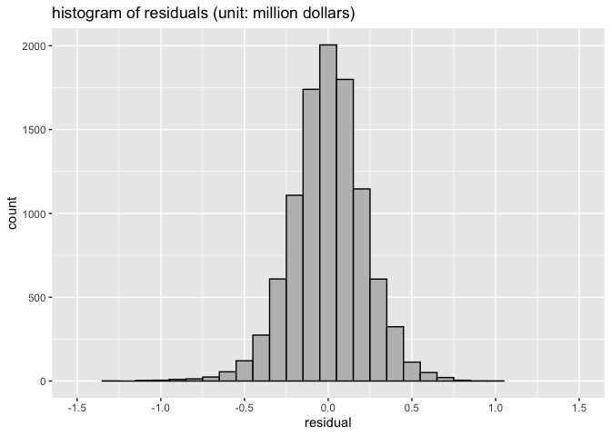<!-- -->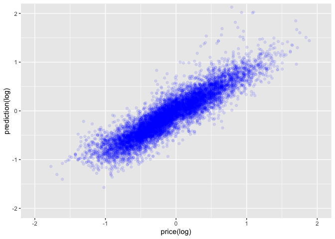<!-- -->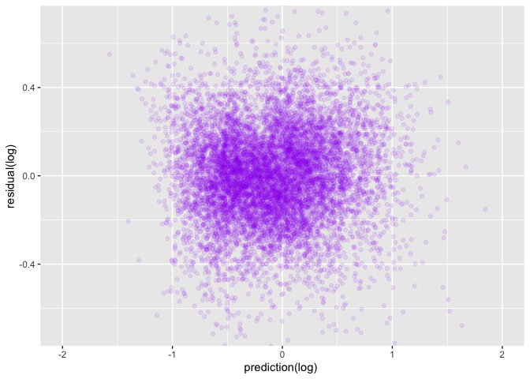<!-- -->

### Algorithm evaluation and selection

The next step is applyting different model to this dataset to see which
model has the best performance. To achieve this, we will use 4 folder
cross validation method and repeat this process 10 times on each model
so we can get the 40 prediction accuracy results for each model to find
out which model has the best accuracy. Let’s start with the linear
model.

#### Linear Model

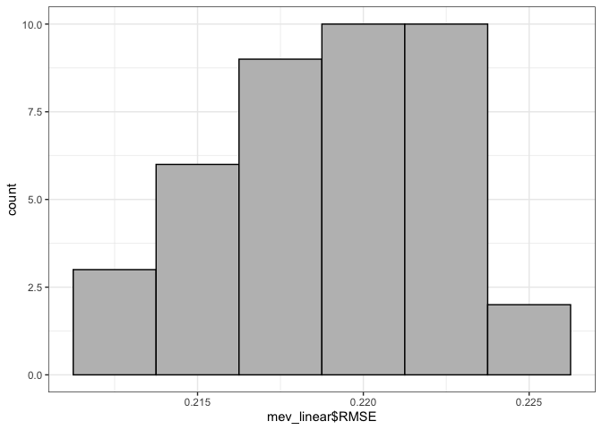<!-- -->

#### Decision Tree

I appled simple decision tree model to the dataset and tuned the
parameter mincriterion, maxdepth to find the combination achieving the
best performance.The combination of these two parameter is how the trees
are pruned. I found that when maxdepth is 0 and mincriterion is 0.1,
simple decision tree model has the best performance. Below shows the
RMSEs of the trees when maxdepth is 0 and mincriterion varied from 0.1
to 1. We can see that when mincriterion is 0.1, RMSE is the smallest.
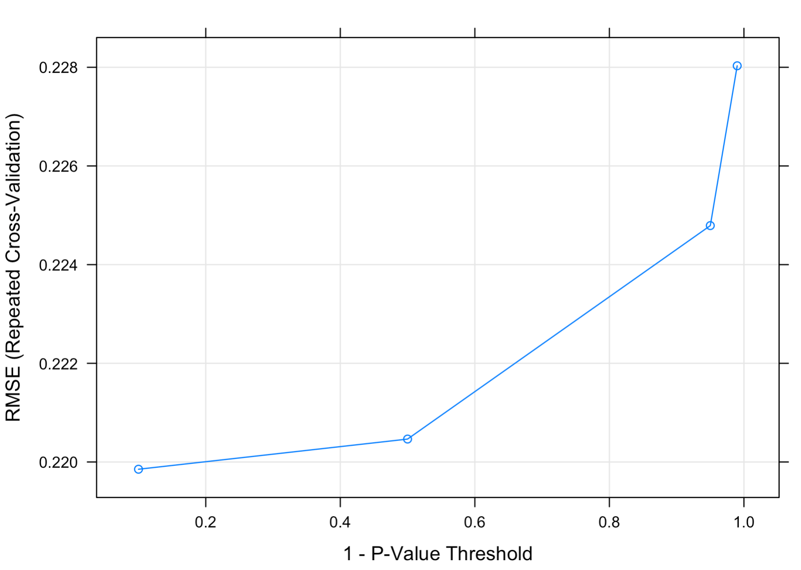 Below is the evaluation of tree model and its
comparison with the linear model

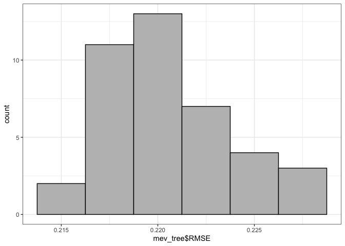<!-- -->

``` 

    Welch Two Sample t-test

data:  mev_linear$RMSE and mev_tree$RMSE
t = -1.9584, df = 77.992, p-value = 0.05376
alternative hypothesis: true difference in means is not equal to 0
95 percent confidence interval:
 -0.00279894789  0.00002300974
sample estimates:
mean of x mean of y 
0.2189465 0.2203344 
```

    [1] "Mean RMSE of linear model is 0.218946461711669"

    [1] "Mean RMSE of tree model is 0.220334430786199"

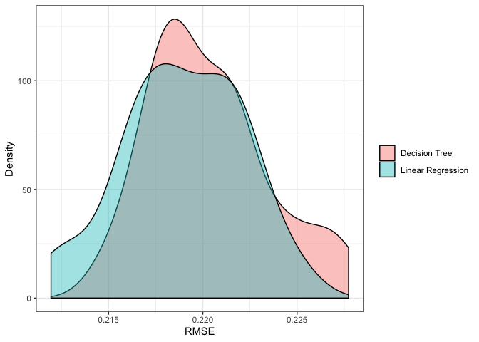<!-- -->

From the t.test and distribution plot above we can find that there is no
signifcant difference between Decision Tree and Linear Regression.

#### Random Forest

I applied random forest to the model. For parameter tuning, I tested 500
trees with number of variable as 3, 7, 11. After 1 hour of testing
running, when the number of variable is 11, model has the minimum RMSE.
Below is the result of the parameter tuning.


I compared the RMSE distribution of random forest with decision tree and
linear regression. We find that random forest signicantly improved the
model performance however the model building is much more time
consuming.

<!-- -->

    [1] "Mean RMSE of Random Forest model is 0.171436928753215"

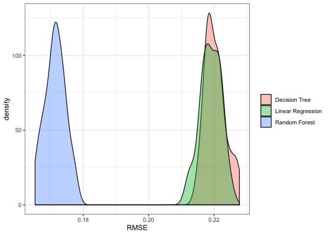<!-- -->

#### Ridge, Lasso, Elastic Regression

I built the Ridge, Lasso and Elastic Regression regression using ‘Caret’
package. Tuning the paramter alpha and lambda to find the best parameter
combination. When alpha is 0, the model is ridge regression. When alpha
is 1, the model is lasso regression. When alpha is between 0 and 1, the
model is Elastic regression. Below shows the RMSE for different alpha
and lambda combination. We can see that when alpha=0 and lambda=0.1, the
model performs best.


I want to see if lambda is continuely lowered, the performance could be
improved. Below is the result. Keeping alpha 0, lambda= 0.01 is still
the best model.


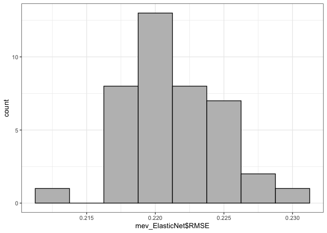<!-- -->

    [1] "Mean RMSE of Ridge Regression model is 0.221478743721946"

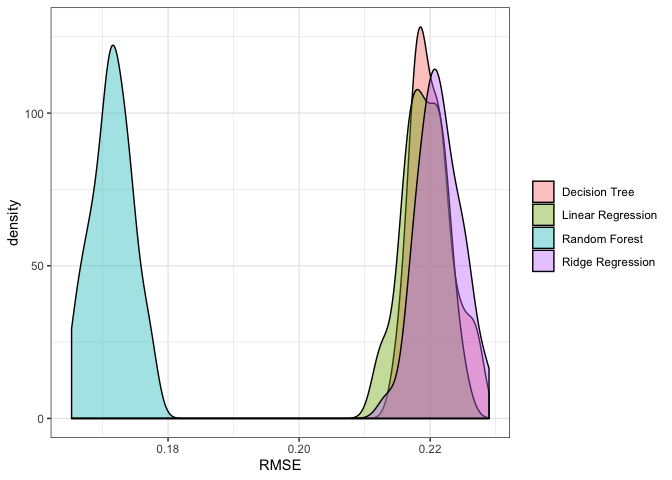<!-- -->

## Reference

De Jonge, E., & Van Der Loo, M. (2013). An introduction to data cleaning
with R. Heerlen: Statistics Netherlands.

Datar, R., & Garg, H. (2019). Hands-on exploratory data analysis with R:
Become an expert in exploratory data analysis using R packages (1st
ed.). UK: Packt Publishing.

Kahle, D., & Wickham, H. (2013). ggmap: Spatial visualization with
ggplot2. The R Journal, 5(1), 144. <doi:10.32614/RJ-2013-014>

James, G., Hastie, T., Tibshirani, R., & Witten, D. (2013). An
introduction to statistical learning: With applications in R Springer
New York.

Hastie, T., Tibshirani, R., Friedman, J. H., & SpringerLink (Online
service). (2009;2013;2001;). The elements of statistical learning: Data
mining, inference, and prediction (2nd ed.). New York, NY: Springer.
<doi:10.1007/978-0-387-21606-5>

Pino, T. P. (2018, October 14). Melbourne Housing Market. Retrieved May
7, 2020, from
<https://www.kaggle.com/anthonypino/melbourne-housing-marke>

Melbourne Suburb Map. (n.d.). Retrieved June 7, 2020, from
<http://melbournesuburbsmap.com>

LocalCouncilMaps. (n.d.). Retrieved June 7, 2020, from
<https://enrol.vec.vic.gov.au/ElectoralBoundaries/LocalCouncilMaps.html>

Melbourne Regions. (n.d.). Retrieved June 7, 2020, from
<https://www.education.vic.gov.au/about/department/structure/Pages/regions.aspx>
