# CKME 136 Capstone Project

# Melbourne House Sales Price Predictive Analysis

#### For best display, please visit project github page <https://github.com/ludejia/CapstoneProject>

#### Analysis and code are in the R mark down file ‘Analysis\_Code.RMD’

#### Dejia Lu

#### Ryerson University 501005537

## Introduction

Since 2010, Melburne housing market was experiencing a housing bubble
and some expert said it might burst soon. However, there was a cooling
period in 2018. The contributor of the housing market data set was
considering buying an apartment. He was seeking data experts to help him
draw some insights on the data to assist his decision making.

In Capstone Project, my goal is to explore and understand the relation
between the final sold price and different variable factors, perform
Predictive Analytics using various machine learning algorithms, compare
the performances and differences among these models and find the best
model for property price prediction. The procedures I will be following
are exploratory analysis, date cleaning, feature engineering, model
building and model evaluation.

## Literature Review

After reviewing books, website, journals and video, I found some
methodologies and techniques are especially helpful in data
visualization and preparation, feature selection & modelling building,
and model performance evaluation.

EDA (exploratory data cleaning) is a very important step when conducting
initial analyse, De Jonge & Van Der Loo’s book (2013) detail various
data preprocessing techniques including missing value handling, data
conversion and data manipulation. They also give examples in R
environment. They suggested various way to impute missing value such as
hot-deck imputation and knn imputation. The book ‘Hands-on exploratory
data analysis with R’(Datar & Garg, 2019) not only demonstrates
practical data manipulation process using different R packages but also
dedicated a big portion in data visualizing utilizing ggplot2 package
which makes the data much more easily to be understood. For example, in
scatter plot and density plot, colors are used as a new dimension to
differentiate categories.

The dataset provides GPS location information for each house. It would
be especially helpful to visualize the houses on the map and to color
these points by different properties to understand the geographic impact
on the houses. The book ggmap: Spatial visualization with ggplot2(Kahle
& Wickham, 2013) showed the step by step approach to import map from
google map and plot those points in a meaningful way.

In terms of feature selection and modeling building, An introduction to
statistical learning: With applications in R (James et al. 2013) has a
comprehensive coverage on all the popular algorithms and their
mathematical explanations. For each algorithm, it has multiple lab
exercise in R environment dedicated to it so you can apply the theory to
real dataset. In the section of linear model selection, it provided
multiple ways to select the best features of the dataset. I learned
Ridge Regression, Lasso Regression, Random Forest and Support Vector
Machine and their application in this book. The elements of statistical
learning: Data mining, inference, and prediction (Hastie et al., 2009)
gives an in-depth math and statistical concepts on modelling and model
evaluations. Due to its missing of application in R environment, I used
this book as a supplement reading to the previous modelling book for the
concepts that I am not so clear about.

## Dataset, data manipulation, feature engineering and selection

The dataset I am using was posted on Kaggle and scraped by the
contributor Pino(2018) from an Australian property website
(Domain.com.au) for the period from 2016 to 2018. The data set contains
the propterty information of has 34857 observations. Each observation
has 21 attributes. Price is the attribute I am building model to
predict. Below provides the summary for the data and visualizaiton of
missing
values.

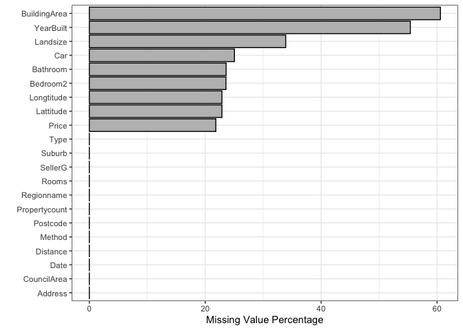<!-- --><!-- -->

#### *Attributes explanation and selection*

#### Lattitude & Longtitude

“Lattitude” & “Longtitude” are the GPS location data. 23% of the data
are missing. Below we can visualize the location of the properties on
google map and see which area has the high density of the property.

<!-- -->
\#\#\#\# Price & PricePerSquareMeters

“Price” is the sold price in Australian dollar for the property. I
replace the unit of price to million Australian dollars. I created a
feature “PriceSQM” to represent price per square meter as it’s also the
common measure of property value and easier to understand its
interaction with the features. I remove the data points having missing
value in price and building area, and remove the outliers on PriceSQM
using boxplot. After the cleaning, total number of observations reduces
to 10395. Below shows the missing value after cleaning and price per
square meter distribution.

I removed the outliers by discarding the data with price per square
meter less than 2000 and over 15000 based on reasonable price range in
Melbourne.

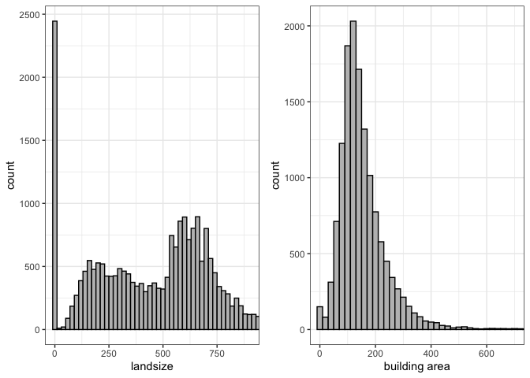<!-- -->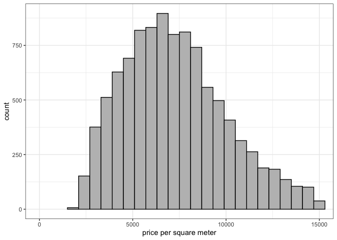<!-- -->

#### BuildingArea, Landsize, Building Area Ratio

“Landsize” is the size of the land the property occupies. “BuildingArea”
is the floor square meters of the house, town house or unit. For unit or
townhouse, landsize could be very big but the building area might be
small as the land are shared by many units or townhouses.

Data cleaning: For the house type, I remove the data having building
areas less than 40 square meters.

For landsize, there are missing values, zero landsize, unreasonable
large landsize and landsizes that are smaller than building area. I
impute these values by the median of different house types.

I replace landsize with Building Area Ratio ( Building Area / Landsize),
because for unit and townhouse, multiple properties share one land, and
Building Area Ratio would be relative small. Building Area ratio
reflects the interaction between landize and building type.

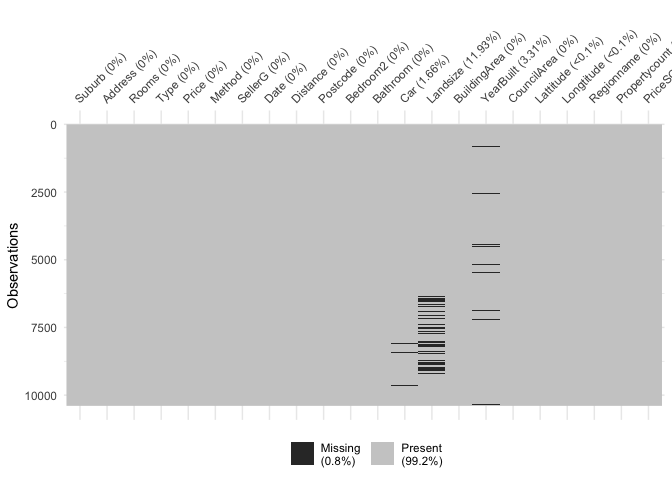<!-- -->

#### Suburb, Postcode, Regionname, CouncilArea

“Suburb”, “Postcode”, “Regionname”, “CouncilArea” divide Melbourne into
different sections. Below we can find Suburb has the finest divisions
(351) whereas regionname only has 9 divisions.

I will only use CouncilArea and region name as the rest have too many
categories.

<!-- -->

This map shows the boundaries of Suburb, Postal Code, Council and
Region.


Below is the price per square meter distribution for different regions.
Quite obvious, southern metropolitan is more expensive. The red the
points on the map are these properties in Southern Metropolitan.

I use council area and Region name as geigraphycal variable and discard
the rest including GPS
info.

<!-- -->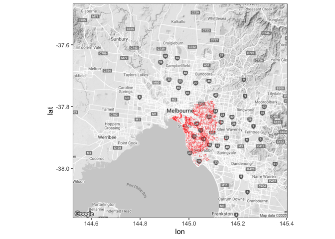<!-- -->

#### Propertycount

“Propertycount” is number of properties that exist in the suburb where
the property is located. We can see most properties are in a suburb
which has less than 50 properties in its suburb. I converted it from
categorial to numeric.

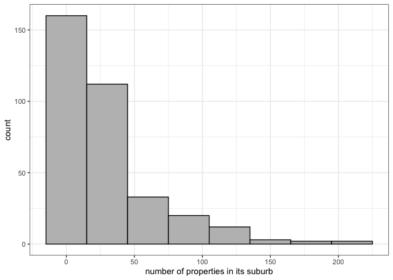<!-- -->

#### address

Each property has its own address. It would not be included in the model
as we already have Regionname, CouncilArea as geographical features.

#### Type

There are three types of houses.

“House” reprents house,cottage,villa, semi,terrace.

“Unit” reprents apartment, condo, duplex.

“Townhouse” repsents townhouse only.

Below we could see the total number of each type and sold price
distribution.

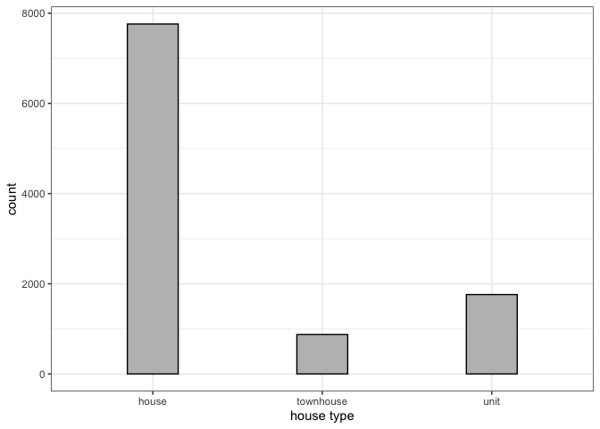<!-- -->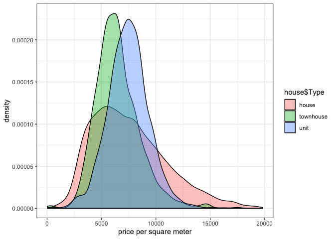<!-- -->

#### Rooms, bedroom2

“Rooms” and “bedroom2” are very similar, which is the number of bedrooms
in the property. “Rooms” has no missing value and “bedroom2” has 23%
percent missing value and is scraped by the contributor from different
sources. “bedroom2” would be discarded in the model.

<!-- -->

#### bathroom

“bathroom” is the number of bathroom. Below we can find “bathroom” and
“rooms” are correlated.

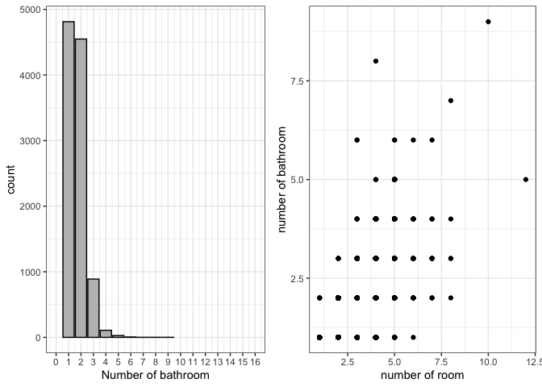<!-- -->

``` 

    Pearson's product-moment correlation

data:  house$Rooms and house$Bathroom
t = 80.279, df = 10053, p-value < 0.00000000000000022
alternative hypothesis: true correlation is not equal to 0
95 percent confidence interval:
 0.6129583 0.6367832
sample estimates:
      cor 
0.6250163 
```

#### car

“car” is the number of parking spots each property has. The bar chart
shows the distribution. Car has 1.67% missing values which are imputed
using median.

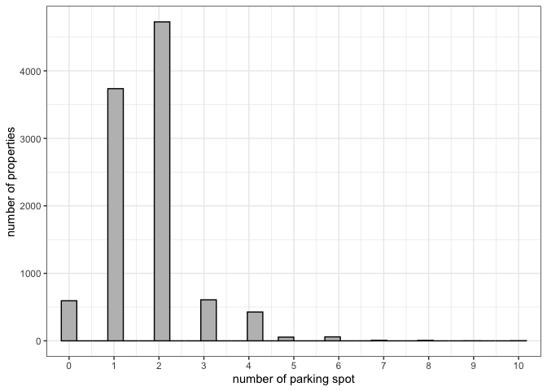<!-- -->

#### Distance

“Distance” is the distance in km from the property to the center
business district.

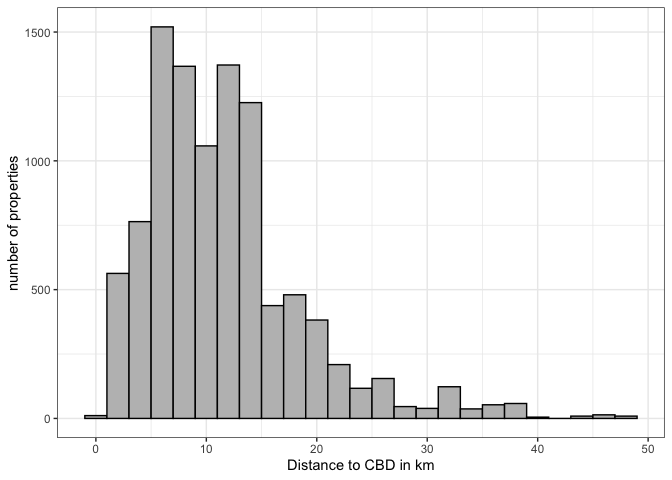<!-- -->

#### yearbuilt

The year the property is built. I group years to diffent categories to
visualize the data. The categories are “\<1900”, “1900~1949”,
“1950~1979”, “1980~1999”,‘2000~2010’. ‘yearbuilt’ has some missing
values. For yearbuilt, I will use numeric format.

I replace one data point built before 1880 with median value.

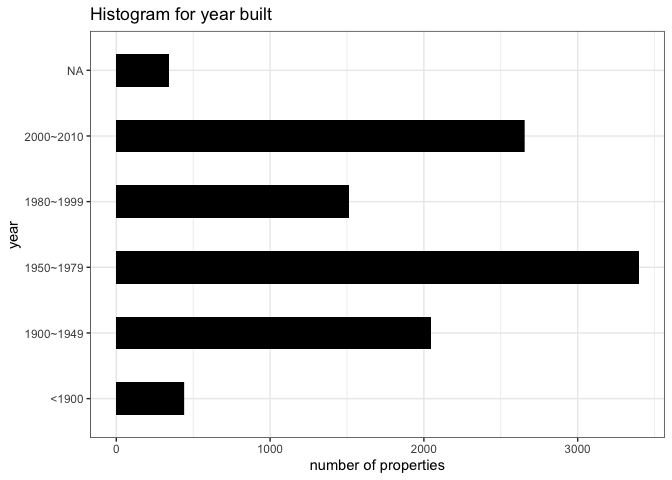<!-- -->

#### date & AVGmonth\_price

“date” is the date the property was sold. The plot shows the average
price per squar meter for all the property sold per month. We could find
the the average month price fluctuate greatly which is a big factor
affacts the price. Instead of using the date, we would use average price
per square meter for all the property sold that specific month as a
variable which reflects seanonal impact of market fluctuation and
economical influency such as demand and supply.There are only 16 data
points for the first month so the average price would can not reflect
the true mean very well. So these data points are removed.

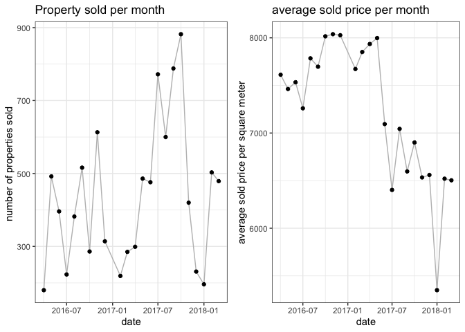<!-- -->

#### method

“method” reflects how the house was sold. Below are the meanings of
different method and the distribution chart.

PI - property passed in;

S - sold not disclosed;

SA - sold after auction;

SP - property sold prior;

VB - vendor bid

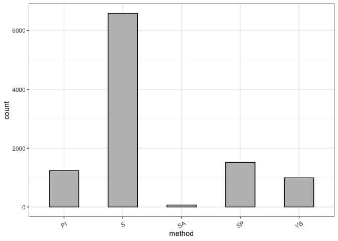<!-- -->

#### SellerG

SellerG is Seller informaion and will not be included.

#### Final dataset to build the model with no missing values

    'data.frame':   10038 obs. of  15 variables:
     $ Rooms            : int  3 4 3 2 3 2 2 3 3 2 ...
     $ Type             : Factor w/ 3 levels "house","townhouse",..: 1 1 1 1 1 3 1 1 1 1 ...
     $ Price            : num  1.47 1.6 1.88 1.1 1.35 ...
     $ Method           : Factor w/ 5 levels "PI","S","SA",..: 4 5 2 2 5 2 2 2 2 2 ...
     $ Distance         : num  2.5 2.5 2.5 2.5 2.5 2.5 2.5 2.5 2.5 2.5 ...
     $ Bathroom         : int  2 1 2 1 2 2 1 2 1 1 ...
     $ Car              : int  0 2 0 2 2 1 2 1 1 1 ...
     $ Landsize         : int  571 571 245 220 214 301 238 113 138 150 ...
     $ BuildingArea     : num  150 142 210 75 190 94 97 110 105 73 ...
     $ YearBuilt        : num  1900 2014 1910 1900 2005 ...
     $ CouncilArea      : Factor w/ 33 levels "Banyule City Council",..: 32 32 32 32 32 32 32 32 32 32 ...
     $ Regionname       : Factor w/ 8 levels "Eastern Metropolitan",..: 3 3 3 3 3 3 3 3 3 3 ...
     $ Propertycount    : num  191 191 191 191 191 191 191 191 191 191 ...
     $ BuildingAreaRatio: num  0.263 0.249 0.857 0.341 0.888 ...
     $ AVGprice         : num  7851 7533 7462 8016 8038 ...
    NULL

<!-- -->

## Approach


#### Step 1: Exploratory Data Analysis

Explore and visualize each attribute and its relation to the prediction
variable; Perform data cleaning and feature engineering to find or
create the best the relevant features to feed into the model;

#### Step 2: Model Building & Tuning

Build models using various algorithms; Fine tuning parameters to achieve
best performance for each algorithm; Adjust features if needed;

#### Step 3: Model Evaluation

Perform cross-validation to compare performance across different models
and decide on the final model.

### linear Modelling

Below is the correlation graph of all the numeric variables and we can
find that number of rooms are hight correlated with number of bathroom.
Price per square meter is highly correlated with YearBuilt and Distance
from CBD.

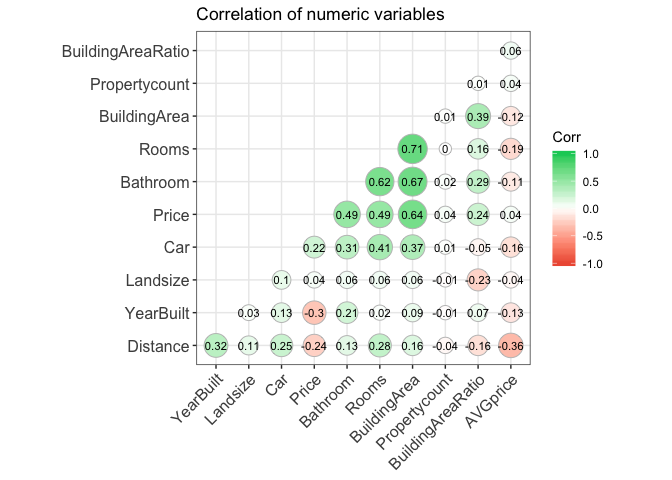<!-- -->

### linear model

Below we implemented forward, backward, forward stepwise and backward
stepwise for feature selection, which all select the same feature
including Rooms, Type, Method, Distance, Bathroom, Car, YearBuilt,
CouncilArea, Regionname, BuildingAreaRatio, AVGprice. Propertycount is
not selected for all the methods.

``` r
null=lm(Price~1,data=house)
full=lm(Price~.,data=house)
stepAIC(null, scope=list(lower=null, upper=full), direction= "forward", trace=TRUE)
stepAIC(full, direction= "backward", trace=TRUE)
stepAIC(null, scope=list(lower=null, upper=full), direction= "both", trace=TRUE)
stepAIC(full, direction= "both", trace=TRUE)
```

Below are the summary of the model.Adjusted R-squared is 0.7548 for this
model. I plot the the prediction, residual of this model.

``` 

Call:
lm(formula = Price ~ Rooms + Type + Method + Distance + Bathroom + 
    Car + BuildingArea + YearBuilt + CouncilArea + Regionname + 
    BuildingAreaRatio + AVGprice, data = house)

Residuals:
    Min      1Q  Median      3Q     Max 
-2.1278 -0.1608 -0.0144  0.1350  3.4949 

Coefficients:
                                              Estimate   Std. Error
(Intercept)                                6.040481025  0.223078257
Rooms                                      0.058586413  0.005438812
Typetownhouse                             -0.116468252  0.013600231
Typeunit                                  -0.317379773  0.011301465
MethodS                                    0.069033265  0.009767946
MethodSA                                   0.017224242  0.039250454
MethodSP                                   0.055926836  0.012118043
MethodVB                                   0.014679670  0.013375537
Distance                                  -0.032519498  0.001246961
Bathroom                                   0.096063150  0.006363059
Car                                        0.022099315  0.003678288
BuildingArea                               0.003562500  0.000072075
YearBuilt                                 -0.002725600  0.000113005
CouncilAreaBayside City Council            0.629943472  0.030436126
CouncilAreaBoroondara City Council         0.569836186  0.028031913
CouncilAreaBrimbank City Council          -0.167151717  0.041069659
CouncilAreaCardinia Shire Council          0.567896291  0.111805410
CouncilAreaCasey City Council              0.273151170  0.058108156
CouncilAreaDarebin City Council            0.145101021  0.024906397
CouncilAreaFrankston City Council          0.510356608  0.053293312
CouncilAreaGlen Eira City Council          0.322172319  0.028955374
CouncilAreaGreater Dandenong City Council  0.199590652  0.052691592
CouncilAreaHobsons Bay City Council        0.063086190  0.043631640
CouncilAreaHume City Council              -0.019273880  0.027166859
CouncilAreaKingston City Council           0.301917490  0.038261981
CouncilAreaKnox City Council               0.007476027  0.033859672
CouncilAreaMacedon Ranges Shire Council    0.357611106  0.104058755
CouncilAreaManningham City Council         0.086849894  0.023739890
CouncilAreaMaribyrnong City Council       -0.059446227  0.043176252
CouncilAreaMaroondah City Council          0.110322310  0.032594366
CouncilAreaMelbourne City Council          0.220553912  0.027105062
CouncilAreaMelton City Council            -0.247857833  0.052622744
CouncilAreaMitchell Shire Council          0.267983109  0.141725501
CouncilAreaMonash City Council             0.254178068  0.026632847
CouncilAreaMoonee Valley City Council      0.067693064  0.042451829
CouncilAreaMoorabool Shire Council        -0.029462408  0.313257884
CouncilAreaMoreland City Council           0.105132901  0.025396937
CouncilAreaNillumbik Shire Council        -0.215157736  0.075669466
CouncilAreaPort Phillip City Council       0.303937146  0.032036332
CouncilAreaStonnington City Council        0.566804451  0.032470396
CouncilAreaWhitehorse City Council         0.150282509  0.029825207
CouncilAreaWhittlesea City Council         0.056609047  0.029444789
CouncilAreaWyndham City Council           -0.210328832  0.043327431
CouncilAreaYarra City Council              0.277919873  0.030055117
CouncilAreaYarra Ranges Shire Council      0.251612641  0.088482372
RegionnameEastern Victoria                -0.066349973  0.066490929
RegionnameNorthern Metropolitan           -0.232192281  0.024267766
RegionnameNorthern Victoria                0.215432261  0.069531856
RegionnameSouth-Eastern Metropolitan      -0.087271025  0.035447062
RegionnameSouthern Metropolitan           -0.117006377  0.025196700
RegionnameWestern Metropolitan            -0.128513682  0.040443480
RegionnameWestern Victoria                 0.261773215  0.072121118
BuildingAreaRatio                         -0.160100219  0.019268954
AVGprice                                  -0.000019245  0.000005343
                                          t value             Pr(>|t|)    
(Intercept)                                27.078 < 0.0000000000000002 ***
Rooms                                      10.772 < 0.0000000000000002 ***
Typetownhouse                              -8.564 < 0.0000000000000002 ***
Typeunit                                  -28.083 < 0.0000000000000002 ***
MethodS                                     7.067 0.000000000001685094 ***
MethodSA                                    0.439             0.660795    
MethodSP                                    4.615 0.000003976701831176 ***
MethodVB                                    1.098             0.272449    
Distance                                  -26.079 < 0.0000000000000002 ***
Bathroom                                   15.097 < 0.0000000000000002 ***
Car                                         6.008 0.000000001943339018 ***
BuildingArea                               49.428 < 0.0000000000000002 ***
YearBuilt                                 -24.119 < 0.0000000000000002 ***
CouncilAreaBayside City Council            20.697 < 0.0000000000000002 ***
CouncilAreaBoroondara City Council         20.328 < 0.0000000000000002 ***
CouncilAreaBrimbank City Council           -4.070 0.000047384242348457 ***
CouncilAreaCardinia Shire Council           5.079 0.000000385618146649 ***
CouncilAreaCasey City Council               4.701 0.000002626934518906 ***
CouncilAreaDarebin City Council             5.826 0.000000005857863144 ***
CouncilAreaFrankston City Council           9.576 < 0.0000000000000002 ***
CouncilAreaGlen Eira City Council          11.127 < 0.0000000000000002 ***
CouncilAreaGreater Dandenong City Council   3.788             0.000153 ***
CouncilAreaHobsons Bay City Council         1.446             0.148242    
CouncilAreaHume City Council               -0.709             0.478054    
CouncilAreaKingston City Council            7.891 0.000000000000003318 ***
CouncilAreaKnox City Council                0.221             0.825257    
CouncilAreaMacedon Ranges Shire Council     3.437             0.000591 ***
CouncilAreaManningham City Council          3.658             0.000255 ***
CouncilAreaMaribyrnong City Council        -1.377             0.168597    
CouncilAreaMaroondah City Council           3.385             0.000715 ***
CouncilAreaMelbourne City Council           8.137 0.000000000000000453 ***
CouncilAreaMelton City Council             -4.710 0.000002509476407201 ***
CouncilAreaMitchell Shire Council           1.891             0.058672 .  
CouncilAreaMonash City Council              9.544 < 0.0000000000000002 ***
CouncilAreaMoonee Valley City Council       1.595             0.110837    
CouncilAreaMoorabool Shire Council         -0.094             0.925070    
CouncilAreaMoreland City Council            4.140 0.000035078698242898 ***
CouncilAreaNillumbik Shire Council         -2.843             0.004473 ** 
CouncilAreaPort Phillip City Council        9.487 < 0.0000000000000002 ***
CouncilAreaStonnington City Council        17.456 < 0.0000000000000002 ***
CouncilAreaWhitehorse City Council          5.039 0.000000476727386530 ***
CouncilAreaWhittlesea City Council          1.923             0.054565 .  
CouncilAreaWyndham City Council            -4.854 0.000001225799299406 ***
CouncilAreaYarra City Council               9.247 < 0.0000000000000002 ***
CouncilAreaYarra Ranges Shire Council       2.844             0.004469 ** 
RegionnameEastern Victoria                 -0.998             0.318362    
RegionnameNorthern Metropolitan            -9.568 < 0.0000000000000002 ***
RegionnameNorthern Victoria                 3.098             0.001952 ** 
RegionnameSouth-Eastern Metropolitan       -2.462             0.013833 *  
RegionnameSouthern Metropolitan            -4.644 0.000003465632334594 ***
RegionnameWestern Metropolitan             -3.178             0.001489 ** 
RegionnameWestern Victoria                  3.630             0.000285 ***
BuildingAreaRatio                          -8.309 < 0.0000000000000002 ***
AVGprice                                   -3.602             0.000318 ***
---
Signif. codes:  0 '***' 0.001 '**' 0.01 '*' 0.05 '.' 0.1 ' ' 1

Residual standard error: 0.306 on 9984 degrees of freedom
Multiple R-squared:  0.7561,    Adjusted R-squared:  0.7548 
F-statistic: 583.9 on 53 and 9984 DF,  p-value: < 0.00000000000000022
```

<!-- --><!-- --><!-- -->

From the above graph, we find that the residual shows high level of
residual heteroscedasticity. So I decide to transform the price to log
price to minimize the heteroscedasticity. After the transformation, we
could find from the plot below that log(price) becomes normally
distributed.

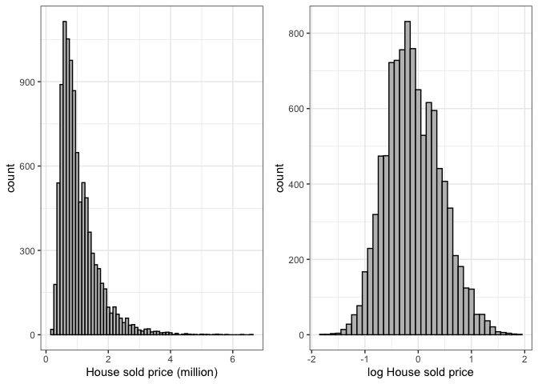<!-- -->

Now I build the model again based using same feature selection methods
like before which all produce the same result and achieve higher adjust
R square. This time ‘BuildingAreaRatio’ is not selected by all the
feature selection methods. I discard this feature in our dataset. Our
final model for linear model is below and adjusted R squared of 0.8206.
From the residual plot we can find that heteroscedasticity is not
obvious.

``` 

Call:
lm(formula = log_Price ~ Rooms + Type + Method + Distance + Bathroom + 
    Car + BuildingArea + YearBuilt + CouncilArea + Regionname + 
    Propertycount + AVGprice, data = house)

Residuals:
     Min       1Q   Median       3Q      Max 
-1.34223 -0.13174  0.00243  0.13559  1.00719 

Coefficients:
                                              Estimate   Std. Error
(Intercept)                                3.916736694  0.159108424
Rooms                                      0.093788231  0.003868198
Typetownhouse                             -0.141194760  0.008945118
Typeunit                                  -0.446905740  0.008064286
MethodS                                    0.082443117  0.006970691
MethodSA                                   0.034304409  0.028009971
MethodSP                                   0.056286178  0.008647514
MethodVB                                   0.003204652  0.009545194
Distance                                  -0.028844425  0.000888039
Bathroom                                   0.056006800  0.004537910
Car                                        0.024417719  0.002589588
BuildingArea                               0.002082159  0.000047005
YearBuilt                                 -0.002148918  0.000080651
CouncilAreaBayside City Council            0.491145590  0.021719912
CouncilAreaBoroondara City Council         0.380456146  0.020008419
CouncilAreaBrimbank City Council          -0.224512350  0.029460957
CouncilAreaCardinia Shire Council          0.333111355  0.079786504
CouncilAreaCasey City Council              0.176660874  0.041465888
CouncilAreaDarebin City Council            0.093585399  0.017811125
CouncilAreaFrankston City Council          0.382511109  0.038027558
CouncilAreaGlen Eira City Council          0.288697049  0.020663866
CouncilAreaGreater Dandenong City Council  0.116718956  0.037618912
CouncilAreaHobsons Bay City Council        0.022653058  0.031435747
CouncilAreaHume City Council              -0.149801231  0.019386638
CouncilAreaKingston City Council           0.292786400  0.027336781
CouncilAreaKnox City Council               0.043313162  0.024165797
CouncilAreaMacedon Ranges Shire Council    0.507524971  0.074271460
CouncilAreaManningham City Council         0.141973957  0.017016952
CouncilAreaMaribyrnong City Council       -0.111601398  0.031060453
CouncilAreaMaroondah City Council          0.137361222  0.023260404
CouncilAreaMelbourne City Council          0.181343044  0.019346291
CouncilAreaMelton City Council            -0.317208357  0.037700908
CouncilAreaMitchell Shire Council          0.117853301  0.101165717
CouncilAreaMonash City Council             0.256388439  0.019013704
CouncilAreaMoonee Valley City Council      0.046819043  0.030560904
CouncilAreaMoorabool Shire Council        -0.117278776  0.223555028
CouncilAreaMoreland City Council           0.044850843  0.018142728
CouncilAreaNillumbik Shire Council        -0.085925163  0.054076955
CouncilAreaPort Phillip City Council       0.225403069  0.022861700
CouncilAreaStonnington City Council        0.364083958  0.023266558
CouncilAreaWhitehorse City Council         0.181917738  0.021338155
CouncilAreaWhittlesea City Council        -0.040689047  0.020995725
CouncilAreaWyndham City Council           -0.343452589  0.030923409
CouncilAreaYarra City Council              0.229251362  0.021431789
CouncilAreaYarra Ranges Shire Council      0.166274095  0.063197972
RegionnameEastern Victoria                -0.022145010  0.047445237
RegionnameNorthern Metropolitan           -0.197851151  0.017316487
RegionnameNorthern Victoria                0.021818286  0.049626415
RegionnameSouth-Eastern Metropolitan      -0.071076957  0.025388575
RegionnameSouthern Metropolitan           -0.100414703  0.017992342
RegionnameWestern Metropolitan            -0.096082718  0.028946895
RegionnameWestern Victoria                 0.026129059  0.051505178
Propertycount                              0.000042703  0.000022450
AVGprice                                  -0.000022195  0.000003813
                                          t value             Pr(>|t|)    
(Intercept)                                24.617 < 0.0000000000000002 ***
Rooms                                      24.246 < 0.0000000000000002 ***
Typetownhouse                             -15.785 < 0.0000000000000002 ***
Typeunit                                  -55.418 < 0.0000000000000002 ***
MethodS                                    11.827 < 0.0000000000000002 ***
MethodSA                                    1.225             0.220709    
MethodSP                                    6.509   0.0000000000793163 ***
MethodVB                                    0.336             0.737078    
Distance                                  -32.481 < 0.0000000000000002 ***
Bathroom                                   12.342 < 0.0000000000000002 ***
Car                                         9.429 < 0.0000000000000002 ***
BuildingArea                               44.296 < 0.0000000000000002 ***
YearBuilt                                 -26.645 < 0.0000000000000002 ***
CouncilAreaBayside City Council            22.613 < 0.0000000000000002 ***
CouncilAreaBoroondara City Council         19.015 < 0.0000000000000002 ***
CouncilAreaBrimbank City Council           -7.621   0.0000000000000275 ***
CouncilAreaCardinia Shire Council           4.175   0.0000300471363128 ***
CouncilAreaCasey City Council               4.260   0.0000205941909019 ***
CouncilAreaDarebin City Council             5.254   0.0000001516339797 ***
CouncilAreaFrankston City Council          10.059 < 0.0000000000000002 ***
CouncilAreaGlen Eira City Council          13.971 < 0.0000000000000002 ***
CouncilAreaGreater Dandenong City Council   3.103             0.001923 ** 
CouncilAreaHobsons Bay City Council         0.721             0.471164    
CouncilAreaHume City Council               -7.727   0.0000000000000121 ***
CouncilAreaKingston City Council           10.710 < 0.0000000000000002 ***
CouncilAreaKnox City Council                1.792             0.073110 .  
CouncilAreaMacedon Ranges Shire Council     6.833   0.0000000000087780 ***
CouncilAreaManningham City Council          8.343 < 0.0000000000000002 ***
CouncilAreaMaribyrnong City Council        -3.593             0.000328 ***
CouncilAreaMaroondah City Council           5.905   0.0000000036334248 ***
CouncilAreaMelbourne City Council           9.374 < 0.0000000000000002 ***
CouncilAreaMelton City Council             -8.414 < 0.0000000000000002 ***
CouncilAreaMitchell Shire Council           1.165             0.244066    
CouncilAreaMonash City Council             13.484 < 0.0000000000000002 ***
CouncilAreaMoonee Valley City Council       1.532             0.125556    
CouncilAreaMoorabool Shire Council         -0.525             0.599867    
CouncilAreaMoreland City Council            2.472             0.013448 *  
CouncilAreaNillumbik Shire Council         -1.589             0.112105    
CouncilAreaPort Phillip City Council        9.859 < 0.0000000000000002 ***
CouncilAreaStonnington City Council        15.648 < 0.0000000000000002 ***
CouncilAreaWhitehorse City Council          8.525 < 0.0000000000000002 ***
CouncilAreaWhittlesea City Council         -1.938             0.052655 .  
CouncilAreaWyndham City Council           -11.107 < 0.0000000000000002 ***
CouncilAreaYarra City Council              10.697 < 0.0000000000000002 ***
CouncilAreaYarra Ranges Shire Council       2.631             0.008526 ** 
RegionnameEastern Victoria                 -0.467             0.640690    
RegionnameNorthern Metropolitan           -11.426 < 0.0000000000000002 ***
RegionnameNorthern Victoria                 0.440             0.660200    
RegionnameSouth-Eastern Metropolitan       -2.800             0.005127 ** 
RegionnameSouthern Metropolitan            -5.581   0.0000000245428510 ***
RegionnameWestern Metropolitan             -3.319             0.000906 ***
RegionnameWestern Victoria                  0.507             0.611949    
Propertycount                               1.902             0.057181 .  
AVGprice                                   -5.821   0.0000000060380761 ***
---
Signif. codes:  0 '***' 0.001 '**' 0.01 '*' 0.05 '.' 0.1 ' ' 1

Residual standard error: 0.2183 on 9984 degrees of freedom
Multiple R-squared:  0.8215,    Adjusted R-squared:  0.8206 
F-statistic: 867.2 on 53 and 9984 DF,  p-value: < 0.00000000000000022
```

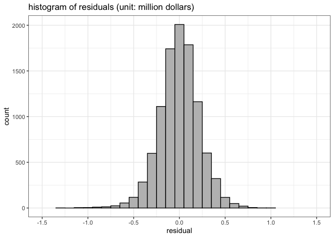<!-- -->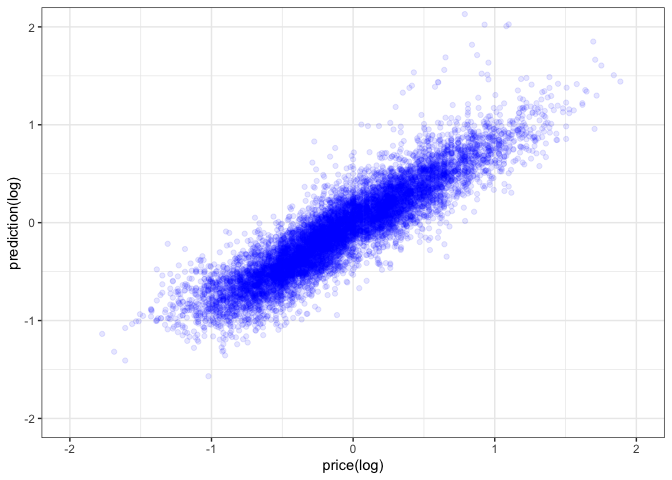<!-- -->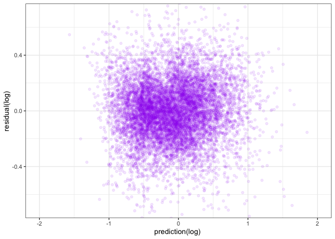<!-- -->

## Reference

De Jonge, E., & Van Der Loo, M. (2013). An introduction to data cleaning
with R. Heerlen: Statistics Netherlands.

Datar, R., & Garg, H. (2019). Hands-on exploratory data analysis with R:
Become an expert in exploratory data analysis using R packages (1st
ed.). UK: Packt Publishing.

Kahle, D., & Wickham, H. (2013). ggmap: Spatial visualization with
ggplot2. The R Journal, 5(1), 144. <doi:10.32614/RJ-2013-014>

James, G., Hastie, T., Tibshirani, R., & Witten, D. (2013). An
introduction to statistical learning: With applications in R Springer
New York.

Hastie, T., Tibshirani, R., Friedman, J. H., & SpringerLink (Online
service). (2009;2013;2001;). The elements of statistical learning: Data
mining, inference, and prediction (2nd ed.). New York, NY: Springer.
<doi:10.1007/978-0-387-21606-5>

Pino, T. P. (2018, October 14). Melbourne Housing Market. Retrieved May
7, 2020, from
<https://www.kaggle.com/anthonypino/melbourne-housing-marke>

Melbourne Suburb Map. (n.d.). Retrieved June 7, 2020, from
<http://melbournesuburbsmap.com>

LocalCouncilMaps. (n.d.). Retrieved June 7, 2020, from
<https://enrol.vec.vic.gov.au/ElectoralBoundaries/LocalCouncilMaps.html>

Melbourne Regions. (n.d.). Retrieved June 7, 2020, from
<https://www.education.vic.gov.au/about/department/structure/Pages/regions.aspx>
