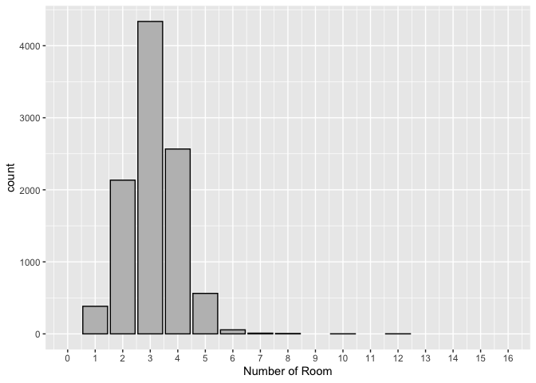
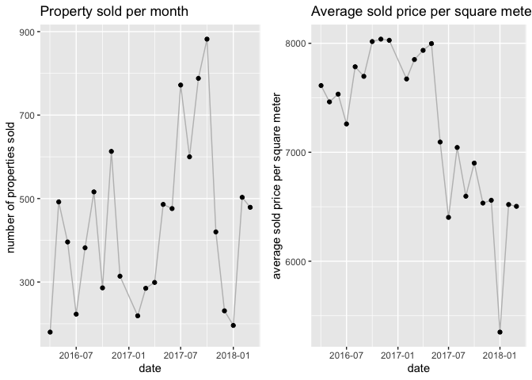

# CKME 136 Capstone Project

# Melbourne House Sales Price Predictive Analysis

#### For best display, please visit project github page <https://github.com/ludejia/CapstoneProject>

#### Analysis and code are in the R mark down file ‘Code.RMD’

#### Dejia Lu

#### Ryerson University 501005537

## 1\. Introduction

Since 2010, Melburne housing market was experiencing a housing bubble
and some expert said it might burst soon. However, there was a cooling
period in 2018. In Kaggle competition forum, the contributor of the
Melburne Housing Market dataset was considering buying an apartment. He
was seeking data experts to help him draw some insights on the data to
assist his decision making.

My Capstone Project is based on this dataset, I performed exploratory
data analysis to understand the data, cleaned and transformed data for
feature engineering and selection, applied 5 machine learning algorithms
to compare the pros & cons, and accuracies of these models and found the
best algorithm for property price prediction.

## 2\. Literature Review

After reviewing books, website, journals and videos, I found some
methodologies and techniques that are especially helpful in data
exploration, visualization, feature engineering, modeling and model
evaluation.

EDA (exploratory data cleaning) is a very important step when conducting
initial analyse, De Jonge & Van Der Loo’s book (2013) detail various
data preprocessing techniques including missing value handling, data
conversion and data manipulation. They also give examples in R
environment. They suggested various way to impute missing value such as
hot-deck imputation and KNN imputation. The book ‘Hands-on exploratory
data analysis with R’ (Datar & Garg, 2019) not only demonstrates
practical data manipulation processes using different R packages but
also dedicates a big portion in data visualizing utilizing ggplot2
package which makes the data much more easily to be understood. For
example, in scatter plot and density plot, colors are used as a new
dimension to differentiate categories.

The dataset provides GPS location information for each house. It would
be especially helpful to visualize the houses on the map and to color
these points by different properties to understand the geographic impact
on the houses. The book ggmap: Spatial visualization with ggplot2 (Kahle
& Wickham, 2013) showed the step by step approach to import map from
google map and plot those points in a meaningful way.

In terms of feature selection and model building, An introduction to
statistical learning: With applications in R (James et al. 2013) has a
comprehensive coverage on all the popular algorithms and their
mathematical explanations. For each algorithm, it has multiple lab
exercise in R environment dedicated to it so you can apply the theory to
real dataset. In the section of linear model selection, it provides
multiple ways to select the best features of the dataset. I learned
Ridge Regression, Lasso Regression, Random Forest and Support Vector
Machine and their application in this book. The elements of statistical
learning: Data mining, inference, and prediction (Hastie et al., 2009)
gives an in-depth math and statistical concepts on modelling and model
evaluations. Due to its missing of application in R environment, I used
this book as a supplement reading to the previous modelling book for the
concepts that I am not so clear about.

## 3\. Approach


### Step 1: Exploratory Data Analysis

Explore and visualize each attribute to understand data and the
relationship between dependent variable and independent variables

### Step 2: Data Tranformation

Perform data cleaning, manipulation and feature engineering to find or
create the best the relevant features to feed into the modeling process

### Step 3: Model Building & Evaluation

Build models using various algorithms; Fine tune parameters to achieve
the best performance for each algorithm; Perform cross-validation to
compare performances across different models and decide on the final
model

## 4\. Data

### 4.1 Data Overview

The dataset I use was posted on Kaggle and scraped by the contributor
Pino (2018) from an Australian property website (Domain.com.au) for the
period from 2016 to 2018. The data set contains the property information
of 34857 observations. Each observation has 21 attributes. Here is the
meaning of all the attributes.

 Price is the attribute I am building models to
predict. The following chart provides the summary for the missing values
percentages of all the attributes, we can find that BuildingArea has the
highest missing value
percentage.

<!-- --><!-- -->

Below we can visualize the locations of the properties in Melbourne
using GPS location information. 23% of the data don’t have GPS
information. Each red spot represents a property.

<!-- -->

### 4.2 Data Transformation

#### 4.2.1 Price & PriceSQM & Log\_Price

Price is the sold price in Australian dollar for the property. I
replaced the unit of price to million Australian dollars. I created a
feature PriceSQM to represent price per square meter as it’s also the
common measure of property value and easier to understand its
interaction with other features. I removed the data points having
missing value in Price and BuildingArea, and removed the outliers on
PriceSQM based on boxplot. After the cleaning, total number of
observations reduces to 10057. I removed the outliers by discarding the
data with price per square meter less than 2000 and over 15000 based on
reasonable price range in Melbourne.

After the data cleaning, as we can see below, missing values are
significantly reduced.

<!-- -->

The chart below is the distribution of the price we are trying to
predict.

<!-- -->

Because it is not normally distributed and will negatively impact the
linear modeling, I applied log transformation to transform Price to
log\_Price. Below shows log\_Price which is normally distributed.

<!-- -->

#### 4.2.2 BuildingArea, Landsize, BuildingAreaRatio

Landsize is the size of the land the property occupies. BuildingArea is
the floor square meters of the house, town house or unit. For unit or
townhouse, Land size could be very big but the building area might be
small as the land are shared by many units or townhouses.

For house, I removed the data having building areas less than 40 square
meters.

For Landsize, there are missing values, zero, unreasonable large land
size and land size that are smaller than building area. I replaced these
erroneous values with the median land size of different property types.

I created a new feature BuildingAreaRatio which is BuildingArea /
Landsize. Because for unit and townhouse, multiple properties share one
common land space, building Area ratio reflects the interaction between
land size and building type.

Below charts show the distributions of land size and building area after
the data transformation.

<!-- -->

#### 4.2.3 Suburb, Postcode, Regionname, CouncilArea

Suburb, Postcode, Regionname, CouncilArea divide Melbourne into
different geographical areas in different ways as below.


We can find Suburb has the finest divisions (351) whereas Regionname
only has 9 divisions. In my model, I will only use CouncilArea,
Regionname as geographical area features.

<!-- -->

Below is the price per square meter distribution for different regions.
As we can see, southern metropolitan is more expensive than other
regions.

<!-- -->

#### 4.2.4 Propertycount

Propertycount is the total number of properties in the suburb where the
property is located. We can see most suburbs have less than 50
properties. I converted its data class from categorial to numeric.

<!-- -->

#### 4.2.5 Type

There are three types of houses. “House” represents house, cottage,
villa, semi-attached, terrace. “Unit” represents apartment, condo,
duplex. “Townhouse” represents townhouse only. I converted its data
class to factor. Below is the log\_Price distributions of each
type.

<!-- --><!-- -->

#### 4.2.6 Rooms, Bedroom2

Rooms and Bedroom2 are the numbers of bedrooms but from different
sources. Rooms has no missing value. bedroom2 has 23% percent missing
value and is from other sources. Below is the distribution of Rooms.

<!-- -->

#### 4.2.7 Car

Car is the number of parking spots each property has. The bar chart
shows its distribution. Car has 1.67% missing values. I imputed the
missing value using median value.

<!-- -->

#### 4.2.8 Distance

Distance is the distance in km from the property to the business center
district. I converted its data type to numeric.

<!-- -->

#### 4.2.9 YearBuilt

YearBuilt is the year the property was built. I replaced missing values
and one property built before 1880 with median YearBuilt value. Below is
the distribution chart for houses built in different periods.

<!-- -->

#### 4.2.10 Date & AVGmonth\_price

Date is the date the property was sold. The plots show monthly trends of
the total number of properties sold and average sold price per square
meter for the period.

<!-- -->

Instead of using the date as a time series feature, I use monthly price
per square meter AVGmonth\_price as a variable to reflect market
seasonal fluctuation due to the change in demand and supply. There are
only 16 data points for the first month so these data points are
removed.

#### 4.2.11 Method

Method is how the house was sold. Below are the meanings of different
methods and the distribution chart. PI - property passed in; S - sold
not disclosed; SA - sold after auction; SP - property sold prior; VB -
vendor bid

<!-- -->

### 4.3 Feature selection

The following features are removed because either better features has
been engineered so they become redundant or they are irrelevant to the
prediction. log\_Price is the value I am predicting.

Removed features: Date, SellerG, Suburb, Address, Postcode, Bedroom2,
Lattitude, Longtitude, PriceSQM, Price

Below is the correlation matrix of all the numeric variables. The top
three correlated variables to log\_Price are BuildingArea, Number of
Rooms, Number of Bathroom.

<!-- -->

I implemented forward, backward, forward stepwise and backward stepwise
feature selection methods as below for the best features, which all
select the same features except for BuildingAreaRatio. We exclude
BuildingAreaRatio in our final dataset.

``` r
null=lm(log_Price~1,data=house)
full=lm(log_Price~.,data=house)
stepAIC(null, scope=list(lower=null, upper=full), direction= "forward", trace=TRUE)
stepAIC(full, direction= "backward", trace=TRUE)
stepAIC(null, scope=list(lower=null, upper=full), direction= "both", trace=TRUE)
stepAIC(full, direction= "both", trace=TRUE)
```

The final dataset for modelling has 14 variables and 10038 observations.
There is no missing value in the dataset.

<!-- -->

## 5\. Modelling & Evaluation

### 5.1 Linear model

I applied the lm function in R to build the linear model. Below are the
details of the model. Model’s adjusted R squared is 0.8208 with p-value
close to 0. log\_Pice is the dependent variable and the rest variables
are regressors.

``` 

Call:
lm(formula = log_Price ~ ., data = house)

Residuals:
     Min       1Q   Median       3Q      Max 
-1.34001 -0.13137  0.00204  0.13512  1.01018 

Coefficients:
                                            Estimate Std. Error t value
(Intercept)                                3.925e+00  1.590e-01  24.676
Rooms                                      9.365e-02  3.866e-03  24.221
Typetownhouse                             -1.394e-01  8.957e-03 -15.565
Typeunit                                  -4.478e-01  8.065e-03 -55.527
MethodS                                    8.246e-02  6.967e-03  11.835
MethodSA                                   3.120e-02  2.801e-02   1.114
MethodSP                                   5.659e-02  8.644e-03   6.547
MethodVB                                   3.478e-03  9.541e-03   0.365
Distance                                  -2.886e-02  8.876e-04 -32.514
Bathroom                                   5.597e-02  4.536e-03  12.341
Car                                        2.383e-02  2.594e-03   9.186
Landsize                                   7.520e-06  2.256e-06   3.333
BuildingArea                               2.079e-03  4.699e-05  44.246
YearBuilt                                 -2.155e-03  8.063e-05 -26.726
CouncilAreaBayside City Council            4.920e-01  2.171e-02  22.662
CouncilAreaBoroondara City Council         3.808e-01  2.000e-02  19.040
CouncilAreaBrimbank City Council          -2.255e-01  2.945e-02  -7.656
CouncilAreaCardinia Shire Council          3.342e-01  7.975e-02   4.190
CouncilAreaCasey City Council              1.776e-01  4.145e-02   4.286
CouncilAreaDarebin City Council            9.372e-02  1.780e-02   5.265
CouncilAreaFrankston City Council          3.827e-01  3.801e-02  10.069
CouncilAreaGlen Eira City Council          2.896e-01  2.066e-02  14.021
CouncilAreaGreater Dandenong City Council  1.176e-01  3.760e-02   3.129
CouncilAreaHobsons Bay City Council        2.234e-02  3.142e-02   0.711
CouncilAreaHume City Council              -1.503e-01  1.938e-02  -7.756
CouncilAreaKingston City Council           2.937e-01  2.732e-02  10.747
CouncilAreaKnox City Council               4.352e-02  2.415e-02   1.802
CouncilAreaMacedon Ranges Shire Council    4.249e-01  7.826e-02   5.430
CouncilAreaManningham City Council         1.421e-01  1.701e-02   8.355
CouncilAreaMaribyrnong City Council       -1.132e-01  3.105e-02  -3.646
CouncilAreaMaroondah City Council          1.374e-01  2.325e-02   5.911
CouncilAreaMelbourne City Council          1.805e-01  1.934e-02   9.333
CouncilAreaMelton City Council            -3.176e-01  3.768e-02  -8.429
CouncilAreaMitchell Shire Council          1.165e-01  1.011e-01   1.152
CouncilAreaMonash City Council             2.572e-01  1.901e-02  13.532
CouncilAreaMoonee Valley City Council      4.588e-02  3.055e-02   1.502
CouncilAreaMoorabool Shire Council        -1.186e-01  2.234e-01  -0.531
CouncilAreaMoreland City Council           4.469e-02  1.813e-02   2.464
CouncilAreaNillumbik Shire Council        -8.710e-02  5.405e-02  -1.611
CouncilAreaPort Phillip City Council       2.261e-01  2.285e-02   9.893
CouncilAreaStonnington City Council        3.645e-01  2.326e-02  15.675
CouncilAreaWhitehorse City Council         1.826e-01  2.133e-02   8.561
CouncilAreaWhittlesea City Council        -4.038e-02  2.099e-02  -1.924
CouncilAreaWyndham City Council           -3.439e-01  3.091e-02 -11.127
CouncilAreaYarra City Council              2.272e-01  2.143e-02  10.602
CouncilAreaYarra Ranges Shire Council      1.659e-01  6.317e-02   2.627
RegionnameEastern Victoria                -2.353e-02  4.742e-02  -0.496
RegionnameNorthern Metropolitan           -1.967e-01  1.731e-02 -11.363
RegionnameNorthern Victoria                2.337e-02  4.960e-02   0.471
RegionnameSouth-Eastern Metropolitan      -7.095e-02  2.538e-02  -2.796
RegionnameSouthern Metropolitan           -1.004e-01  1.798e-02  -5.581
RegionnameWestern Metropolitan            -9.435e-02  2.894e-02  -3.261
RegionnameWestern Victoria                 2.679e-02  5.148e-02   0.520
Propertycount                              4.321e-05  2.244e-05   1.926
AVGprice                                  -2.202e-05  3.811e-06  -5.777
                                          Pr(>|t|)    
(Intercept)                                < 2e-16 ***
Rooms                                      < 2e-16 ***
Typetownhouse                              < 2e-16 ***
Typeunit                                   < 2e-16 ***
MethodS                                    < 2e-16 ***
MethodSA                                  0.265336    
MethodSP                                  6.15e-11 ***
MethodVB                                  0.715460    
Distance                                   < 2e-16 ***
Bathroom                                   < 2e-16 ***
Car                                        < 2e-16 ***
Landsize                                  0.000862 ***
BuildingArea                               < 2e-16 ***
YearBuilt                                  < 2e-16 ***
CouncilAreaBayside City Council            < 2e-16 ***
CouncilAreaBoroondara City Council         < 2e-16 ***
CouncilAreaBrimbank City Council          2.09e-14 ***
CouncilAreaCardinia Shire Council         2.81e-05 ***
CouncilAreaCasey City Council             1.84e-05 ***
CouncilAreaDarebin City Council           1.43e-07 ***
CouncilAreaFrankston City Council          < 2e-16 ***
CouncilAreaGlen Eira City Council          < 2e-16 ***
CouncilAreaGreater Dandenong City Council 0.001761 ** 
CouncilAreaHobsons Bay City Council       0.477085    
CouncilAreaHume City Council              9.66e-15 ***
CouncilAreaKingston City Council           < 2e-16 ***
CouncilAreaKnox City Council              0.071600 .  
CouncilAreaMacedon Ranges Shire Council   5.78e-08 ***
CouncilAreaManningham City Council         < 2e-16 ***
CouncilAreaMaribyrnong City Council       0.000268 ***
CouncilAreaMaroondah City Council         3.50e-09 ***
CouncilAreaMelbourne City Council          < 2e-16 ***
CouncilAreaMelton City Council             < 2e-16 ***
CouncilAreaMitchell Shire Council         0.249363    
CouncilAreaMonash City Council             < 2e-16 ***
CouncilAreaMoonee Valley City Council     0.133176    
CouncilAreaMoorabool Shire Council        0.595592    
CouncilAreaMoreland City Council          0.013738 *  
CouncilAreaNillumbik Shire Council        0.107115    
CouncilAreaPort Phillip City Council       < 2e-16 ***
CouncilAreaStonnington City Council        < 2e-16 ***
CouncilAreaWhitehorse City Council         < 2e-16 ***
CouncilAreaWhittlesea City Council        0.054367 .  
CouncilAreaWyndham City Council            < 2e-16 ***
CouncilAreaYarra City Council              < 2e-16 ***
CouncilAreaYarra Ranges Shire Council     0.008623 ** 
RegionnameEastern Victoria                0.619745    
RegionnameNorthern Metropolitan            < 2e-16 ***
RegionnameNorthern Victoria               0.637548    
RegionnameSouth-Eastern Metropolitan      0.005183 ** 
RegionnameSouthern Metropolitan           2.46e-08 ***
RegionnameWestern Metropolitan            0.001116 ** 
RegionnameWestern Victoria                0.602781    
Propertycount                             0.054181 .  
AVGprice                                  7.83e-09 ***
---
Signif. codes:  0 '***' 0.001 '**' 0.01 '*' 0.05 '.' 0.1 ' ' 1

Residual standard error: 0.2182 on 9983 degrees of freedom
Multiple R-squared:  0.8217,    Adjusted R-squared:  0.8208 
F-statistic: 852.2 on 54 and 9983 DF,  p-value: < 2.2e-16
```

From the plots below, we can find the residuals are normally distributed
and there is no obvious heteroscedasticity in the residual and
prediction relationship. The plot of predictions and actual prices is a
roughly a 45-degree line. I can conclude that the linear model performs
pretty well.

<!-- -->

<!-- -->

<!-- -->

#### Model Evaluation:

I use the train function in package “caret” and choose 4-fold cross
validation with 10 repeats so I can get a sample of 40 test-set results
of RMSE. Below is the Boxplot of these 40 RMSE test-set results with a
mean of 0.2189 for Linear Regression.

<!-- -->

    [1] "Mean RMSE of linear model is 0.218946461711669"

### 5.2 Decision Tree

#### Parameter Tuning:

I use the train function in package “caret” with “ctree2” method and
choose 4-fold cross validation with 10 repeats to tune the best
parameters in order to minimize the mean RMSE of the 40 test-set
samples. The two parameters I tuned were maxdepth and mincriterion. They
decide how the tree is pruned. I tried multiple values for maxdepth and
mincriterion. When maxdepth is 0 which means there is no limit for the
depth of branch, and mincriterion (p-vlaue in chart below) changes from
1 to 0.1, RMSE are lowered (Chart below). For the final model of
decision tree, I chose maxdepth = 0 and mincriterion= 0.1.


#### Model Evaluation:

Same as liner model, below is the boxplot of 40 RMSE test-set results of
decision tree in comparison with linear regression.

    [1] "Mean RMSE of Decision Tree model is 0.220334430786199"

<!-- -->

I cannot really tell if the difference is significant, so I run t.test
and the t.test result shows insignificant difference.

``` 

    Welch Two Sample t-test

data:  mev_linear$RMSE and mev_tree$RMSE
t = -1.9584, df = 77.992, p-value = 0.05376
alternative hypothesis: true difference in means is not equal to 0
95 percent confidence interval:
 -2.798948e-03  2.300974e-05
sample estimates:
mean of x mean of y 
0.2189465 0.2203344 
```

### 5.2 Random Forest

#### Parameter Tuning:

I used the “train” function with method “rf” for random forest parameter
optimization. The tuning parameters are the number of trees and the
number of randomly selected predictors chosen in each tree. I tested 500
trees with the number of randomly selected predictors as 3, 7, 11. After
1 hour of testing running, when the number of randomly selected
predictors is 11, model has the minimum RMSE. I did not test too many
parameters due to length of computation time. Below is the result of the
parameter tuning. The final parameter is 500 trees with 11 randomly
selected predictors for each tree.


#### Model Evaluation:

Below is the boxplot of 40 RMSE test-set results of random forest model
in comparison with linear model. Mean RMSE of Random Forest model is
0.1714. We can find random forest achieved significant lower RMSE.

    [1] "Mean RMSE of Random Forest model is 0.171436928753215"

<!-- -->

### 5.4 Ridge, Lasso, Elastic Regression

#### Parameter Tuning:

I used “train” function with method “glmnet” and tuned parameter Mixing
Percentage (alpha) and Regularization Parameter(lambda) to find the best
parameter combination. When alpha is 0, the model is ridge regression.
When alpha is 1, the model is lasso regression. When alpha is between 0
and 1, the model is Elastic regression. I tried different parameters to
get the best result and below is the summary. We can see when Mixing
Percentage is 0 and Regularization Parameter is 0.1, model has the
lowest RMSE. I kept Mixing Percentage at 0 and tried regularization
parameters below 0.1. I found when regularization parameter is 0.01, the
model achieved lowest RMSE.


#### Model Evaluation:

I built the model using alpha=0 and lambda=0.01, which is ridge
regression. Below is the boxplot of 40 RMSE test-set results of ridge
regression model in comparison with previous models. Mean RMSE of ridge
regression model is 0.2214. We can find random forest still has the
lowest RMSE.

    [1] "Mean RMSE of Ridge Regression model is 0.221478743721946"

<!-- -->

### 5.5 XGBoost

#### Parameter Tuning:

I used “train” function with method “xgbTree” and tuned number of
boosting iterations and shrinkage. We can see more iterations produce
better result and 0.1 is the best shrinkage. With the increasing number
of trees, the model building becomes much slower but the more accurate.
It’s very time consuming to tune more than 500 build model on more than
500 trees. The final number of iterations I chose is 500 and 0.1 is
value for shrinkage.


#### Model Evaluation:

The tuning parameter for the final model are nrounds=500, eta=0.1,
gamma=0,max\_depth=6,colsample\_bytree=1,min\_child\_weight=1,subsample=1.
Below is the boxplot of 40 RMSE test-set results of XGBoost model in
comparison with previous models. Mean RMSE of XGBoost model is 0.1591.
We can conclude that XGBoost has the lowest RMSEs and outperformed all
the other models.

    [1] "Mean RMSE of XGBoost model is 0.158913523957175"

<!-- -->

## 6\. Conclusion

We can find that random forest, XGBoost outperform the other models at
cost of much longer model building time due to their complexity. There
is still some potential to bring the RMSE even lower for random forest
and XGBoost because I have not explored all the possible parameter
combinations due to my limited laptop computational resources. XGB boost
is a very powerful algorithm as it takes less time to build model and
more accurate than random forest.

Linear models are simple and very fast to build, easier to interpret
compared to random forest and XGBoost. They are also very helpful in
exploratory analysis to understand the relevant features. However, their
predictions are not as good as those more complex models.

Throughout the entire project 80 percent of the time was spent on
exploratory analysis and data transformation. It’s crucial to have a
good domain knowledge in order to understand the data and the
relationship between the features. Proficient data manipulation and
feature engineering skills will make you much more efficient to prepare
the best dataset for the model tuning and building. This project gave me
invaluable hands-on experiences on the many subjects in data science.

## Reference

De Jonge, E., & Van Der Loo, M. (2013). An introduction to data cleaning
with R. Heerlen: Statistics Netherlands.

Datar, R., & Garg, H. (2019). Hands-on exploratory data analysis with R:
Become an expert in exploratory data analysis using R packages (1st
ed.). UK: Packt Publishing.

Kahle, D., & Wickham, H. (2013). ggmap: Spatial visualization with
ggplot2. The R Journal, 5(1), 144. <doi:10.32614/RJ-2013-014>

James, G., Hastie, T., Tibshirani, R., & Witten, D. (2013). An
introduction to statistical learning: With applications in R Springer
New York.

Hastie, T., Tibshirani, R., Friedman, J. H., & SpringerLink (Online
service). (2009;2013;2001;). The elements of statistical learning: Data
mining, inference, and prediction (2nd ed.). New York, NY: Springer.
<doi:10.1007/978-0-387-21606-5>

Pino, T. P. (2018, October 14). Melbourne Housing Market. Retrieved May
7, 2020, from
<https://www.kaggle.com/anthonypino/melbourne-housing-marke>

Melbourne Suburb Map. (n.d.). Retrieved June 7, 2020, from
<http://melbournesuburbsmap.com>

LocalCouncilMaps. (n.d.). Retrieved June 7, 2020, from
<https://enrol.vec.vic.gov.au/ElectoralBoundaries/LocalCouncilMaps.html>

Melbourne Regions. (n.d.). Retrieved June 7, 2020, from
<https://www.education.vic.gov.au/about/department/structure/Pages/regions.aspx>
